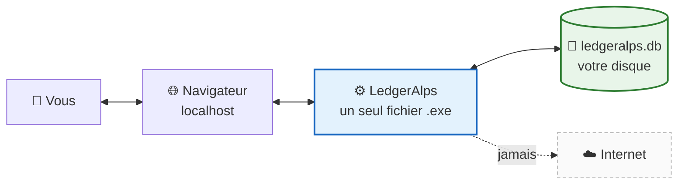

# LedgerAlps

**Facturation et comptabilité pour les indépendants et PME de Suisse.**

*Vos données restent sur votre machine. Pas de cloud, pas d'abonnement,
pas de compte à créer chez qui que ce soit.*

---

## Installation

Téléchargez `LedgerAlps_Setup_<version>_windows_amd64.exe` depuis la page
**[Releases](https://github.com/kmdn-ch/LedgerAlps/releases/latest)**, puis
double-cliquez.

Au premier lancement, LedgerAlps ouvre votre navigateur et vous demande de créer
votre compte. **Il n'y a rien d'autre à configurer.**

> Vos données sont enregistrées dans `%APPDATA%\LedgerAlps\` et survivent aux
> mises à jour comme aux désinstallations.

*Linux : voir le [guide de déploiement](docs/PRODUCTION.md).*

---

## Où vont vos données

Le serveur, la base et l'interface tiennent dans **un seul exécutable**, écouté
sur votre machine. Aucun appel réseau n'est fait — les avis de conformité
eux-mêmes sont livrés avec l'application et fonctionnent hors ligne.

---

## Ce que fait LedgerAlps

<table>
<tr>
<td width="50%" valign="top">

### 📄 Facturation

Factures, offres de prix et notes de crédit, avec le bulletin **QR-facture**
suisse conforme au standard des banques (SIX IG v2.4).

Une offre acceptée devient une facture en un clic : l'offre est conservée telle
qu'elle a été envoyée, et les deux documents restent liés.

</td>
<td width="50%" valign="top">

### 📚 Comptabilité

Journal en partie double, plan comptable PME suisse préchargé, grand livre,
balance de vérification, bilan et compte de résultat.

Clôture d'exercice qui vire réellement le résultat, et **verrouille** la période
close.

</td>
</tr>
<tr>
<td valign="top">

### 🧾 TVA

Méthode effective ou taux de la dette fiscale nette (TDFN), arrondi suisse à
5 centimes. Les factures fournisseurs alimentent l'impôt préalable déductible.

LedgerAlps **refuse** de facturer de la TVA si vous n'avez pas de numéro de TVA :
la mentionner sans y avoir droit vous en rendrait redevable.

</td>
<td valign="top">

### 🏦 Banque

Export de virements et import de relevés aux formats **ISO 20022**
(`pain.001`, `camt.053`).

Validation d'IBAN selon le registre officiel — longueur imposée par le pays et
clé de contrôle, pas seulement le calcul MOD-97.

</td>
</tr>
<tr>
<td valign="top">

### 🔒 Conformité

Écritures scellées par une **chaîne d'empreintes SHA-256** (CO art. 957a) que
vous pouvez vérifier vous-même, d'un bouton.

Attestation d'intégrité téléchargeable pour votre fiduciaire — qui dit aussi bien
ce qu'elle prouve que ce qu'elle ne prouve pas.

</td>
<td valign="top">

### 💾 Sauvegardes

Instantané automatique, chiffrable par une phrase de passe (Argon2id +
XChaCha20-Poly1305).

Restauration annulable : votre comptabilité actuelle est sauvegardée avant d'être
remplacée.

</td>
</tr>
</table>

**Achats et paiements.** Saisissez les factures que vous recevez : la TVA payée à
vos fournisseurs se déduit de celle que vous encaissez, et la charge entre dans
votre résultat. Une fois comptabilisées, cochez celles à régler — LedgerAlps
produit le fichier de paiement **ISO 20022 pain.001** que vous déposez dans votre
e-banking (UBS, PostFinance, Raiffeisen, Banques cantonales).

Le fichier est téléchargé sur votre poste, jamais transmis : LedgerAlps ne parle
à aucune banque. Et générer le fichier ne marque rien comme payé — c'est le
relevé bancaire, importé au format camt.053, qui l'établit.

**Ce que vous remettez à votre fiduciaire.** Journal général, grand livre et
balance de vérification s'exportent en CSV depuis l'onglet Rapports — ouvrables
directement dans Excel, accents compris. L'archive légale ZIP contient dix ans de
pièces en JSON *et* en CSV. Un compte en lecture seule peut produire tout cela
sans pouvoir rien modifier.

**Comptes et accès.** Trois rôles — administrateur, comptable, lecture seule —
pour ouvrir vos livres à votre fiduciaire sans lui donner les clés. Le compte
administrateur est protégé par un **second facteur** : un code à six chiffres
calculé par votre téléphone, hors ligne, avec l'application de votre choix
(Aegis, KeePassXC, FreeOTP conviennent et sont libres). Dix codes de secours sont
remis à l'inscription — notez-les : sans eux, un téléphone perdu ferme la porte
définitivement.

Un mot de passe oublié se règle depuis Paramètres → Sécurité : l'administrateur
réinitialise l'accès, ce qui remplace le mot de passe par un mot de passe
temporaire — sans jamais lire l'ancien — que la personne devra changer à sa
connexion suivante.

> À la première connexion après la mise à jour, l'administrateur devra inscrire
> son téléphone avant de pouvoir travailler.

**Vos données sont les vôtres.** L'archive légale contient dix ans de pièces en
JSON *et* en CSV — ouvrable dans un tableur, importable ailleurs. Le verrouillage
fournisseur ne tient pas au refus d'exporter, il tient au format de l'export.

---

## Pourquoi local plutôt que cloud

| | LedgerAlps | Solutions cloud |
|---|---|---|
| Où sont vos données | **sur votre machine** | sur les serveurs d'un tiers |
| Coût | **gratuit, open source** | abonnement mensuel |
| Si le fournisseur ferme | **rien ne change** | vous devez migrer |
| Accès à vos données | **un fichier que vous possédez** | export, quand c'est proposé |
| Fonctionne hors ligne | **oui** | non |

---

## Questions fréquentes

<b>Mes données partent-elles quelque part ?</b>

Non. LedgerAlps fonctionne entièrement sur votre machine. Les avis de conformité
sont livrés avec l'application, sans appel réseau.

<b>Que se passe-t-il si je perds mon ordinateur ?</b>

Vous perdez votre comptabilité si vous n'avez pas de copie ailleurs. Les
sauvegardes automatiques sont écrites sur le **même** disque : copiez-les
régulièrement sur un support externe. Le CO impose de conserver vos pièces
dix ans.

<b>Que contient une sauvegarde ?</b>

Tout ce que LedgerAlps enregistre, en un seul fichier : factures, offres et notes
de crédit avec leurs lignes, contacts, journal et plan comptable, paiements,
exercices, factures fournisseurs, paramètres de société — logo compris — et le
journal d'audit.

Ce qui n'y est **pas** : le logiciel lui-même, et le fichier de configuration qui
contient la clé de session. Restaurer sur une autre machine ramène donc toute
votre comptabilité ; il faudra simplement vous reconnecter.

<b>Mes données sont-elles chiffrées sur le disque ?</b>

Trois protections, qui ne couvrent pas la même chose :

- **Vos sauvegardes** le sont dès que vous enregistrez une phrase de passe
  (Paramètres → Sauvegardes). C'est la copie qui part sur une clé USB ou un NAS,
  donc la plus exposée.
- **La base elle-même** peut l'être, en option (Paramètres → Maintenance →
  Sécurité). Elle reste alors illisible même copiée ailleurs.
- **Le disque entier**, avec BitLocker ou LUKS. C'est par là qu'il faut
  commencer : c'est gratuit, déjà dans votre système, et cela protège aussi vos
  documents et vos courriels — ce que les deux autres ne font pas.

Le [guide de déploiement](docs/PRODUCTION.md#chiffrement-au-repos--ce-qui-protège-quoi)
détaille ce que chacune protège, et ce qu'aucune ne protège : un programme lancé
sous votre compte Windows accède à vos données dans tous les cas.

<b>Si je chiffre la base, que se passe-t-il quand je change d'ordinateur ?</b>

LedgerAlps vous demande votre **phrase de récupération** — celle que vous avez
notée en activant le chiffrement — puis redémarre normalement. C'est une page
unique, qui s'ouvre toute seule.

Cette phrase est obligatoire à l'activation, et pour une raison précise : la clé
est normalement scellée à votre compte Windows, ce qui évite d'avoir à taper quoi
que ce soit au quotidien. Un profil recréé ou un Windows réinstallé rend ce
scellement illisible. Sans phrase de récupération, dix ans de pièces que le
CO art. 958f vous impose de conserver deviendraient illisibles — une mesure de
confidentialité ne doit pas créer une perte de données.

Et si vous avez perdu les deux : vos **sauvegardes** ne dépendent pas de cette
clé. Installez LedgerAlps normalement et restaurez la plus récente.

<b>Les sauvegardes sont-elles chiffrées ?</b>

Oui, si vous le demandez. À la création, LedgerAlps propose une phrase de passe :
le fichier devient alors illisible sans elle. C'est ce qui compte quand la copie
part sur une clé USB ou un NAS.

Deux points : choisissez-la **différente de votre mot de passe de connexion**, et
notez-la **ailleurs que sur cet ordinateur**. Sans elle, personne ne peut ouvrir
la sauvegarde — vous non plus.

<b>Puis-je annuler une restauration ?</b>

Oui. Avant de restaurer, LedgerAlps sauvegarde votre comptabilité actuelle —
protégée par la même phrase de passe que la sauvegarde restaurée. Si vous vous
êtes trompé de fichier, elle est là, dans la liste.

<b>Je ne suis pas assujetti à la TVA. Que dois-je écrire sur mes factures ?</b>

**Aucune mention n'est légalement obligatoire.** Ce qui existe est une
**interdiction** : si vous n'êtes pas inscrit au registre des assujettis, vous
n'avez pas le droit de faire figurer la TVA sur vos factures (LTVA art. 27 al. 1)
— et si vous le faites quand même, vous en devenez **redevable** (al. 2), même
sans l'avoir encaissée.

Concrètement : laissez vos lignes à **0 %**. LedgerAlps n'imprime alors aucune
ligne de TVA, votre IDE s'affiche seul, et il refusera de toute façon d'établir
une facture portant de la TVA tant qu'aucun numéro de TVA n'est enregistré.

Beaucoup ajoutent par courtoisie une note « TVA non applicable — non assujetti »
dans le champ Notes ; c'est un usage, pas une obligation.

<b>Ai-je le droit d'exporter les documents d'un client depuis sa fiche ?</b>

Oui, sans réserve. Ces factures sont **vos** pièces comptables, que le CO
art. 958f vous impose de conserver dix ans.

C'est même l'inverse d'un problème : cet export est le moyen de répondre à une
demande d'**accès** (nLPD art. 25, à traiter en trente jours) ou de **remise des
données** (art. 28, gratuitement).

Ce qui vous engage commence **après** : le fichier contient des données
personnelles et quitte votre machine.

<b>L'anonymisation d'un contact efface-t-elle aussi les sauvegardes ?</b>

Non. Une sauvegarde est une copie figée : celles prises avant l'anonymisation
contiennent encore les coordonnées, et les réécrire leur retirerait la valeur
qu'elles ont pour vos livres. Elles disparaissent d'elles-mêmes à mesure que de
nouvelles sont prises.

D'ici là, la règle qui vous revient : **ne pas restaurer une sauvegarde
antérieure pour retrouver ces données** — et appliquer la même règle aux copies
gardées sur un NAS ou une clé USB.

<b>Puis-je l'utiliser à plusieurs ?</b>

Un seul compte pour l'instant. La gestion multi-utilisateurs avec rôles — dont un
accès en lecture seule pour votre fiduciaire — est
[planifiée](ROADMAP.md#9--multi-utilisateurs--permissions).

<b>Est-ce que je peux faire confiance aux calculs ?</b>

Le code est ouvert et vérifiable, et la conformité QR-facture, TVA et comptable
est couverte par des tests automatisés. Cela dit, **LedgerAlps est un outil, pas
un conseil fiscal** : votre fiduciaire reste votre interlocuteur.

---

## Plateformes

**Windows x86-64** et **Linux x86-64**. Sur un PC Windows ARM, l'installeur
x86-64 fonctionne par émulation. Pour macOS ou ARM, il faut compiler depuis les
sources — le [pourquoi](ROADMAP.md#plateformes-prises-en-charge) tient en une
phrase : publier un binaire, c'est promettre qu'il fonctionne, et ceux-là
n'étaient pas testés.

---

## Documentation

| Document | Pour qui |
|---|---|
| [Roadmap](ROADMAP.md) | ce qui arrive, et ce qui n'arrivera pas |
| [Déploiement serveur](docs/PRODUCTION.md) | installer sur Linux ou un serveur de bureau |
| [Architecture](docs/ARCHITECTURE.md) | comprendre comment c'est construit |
| [Développement](docs/DEVELOPMENT.md) | compiler, tester, contribuer |
| [Référence API](docs/API.md) | intégrer un autre outil |
| [Veille de conformité](compliance/README.md) | suivi des évolutions légales |
| [Branches et releases](docs/BRANCHING.md) | processus de publication |

---

## Contribuer

Les contributions sont bienvenues — voir
[docs/DEVELOPMENT.md](docs/DEVELOPMENT.md) pour compiler le projet et
[docs/BRANCHING.md](docs/BRANCHING.md) pour le processus.

**Licence MIT** — voir [LICENSE](LICENSE).
