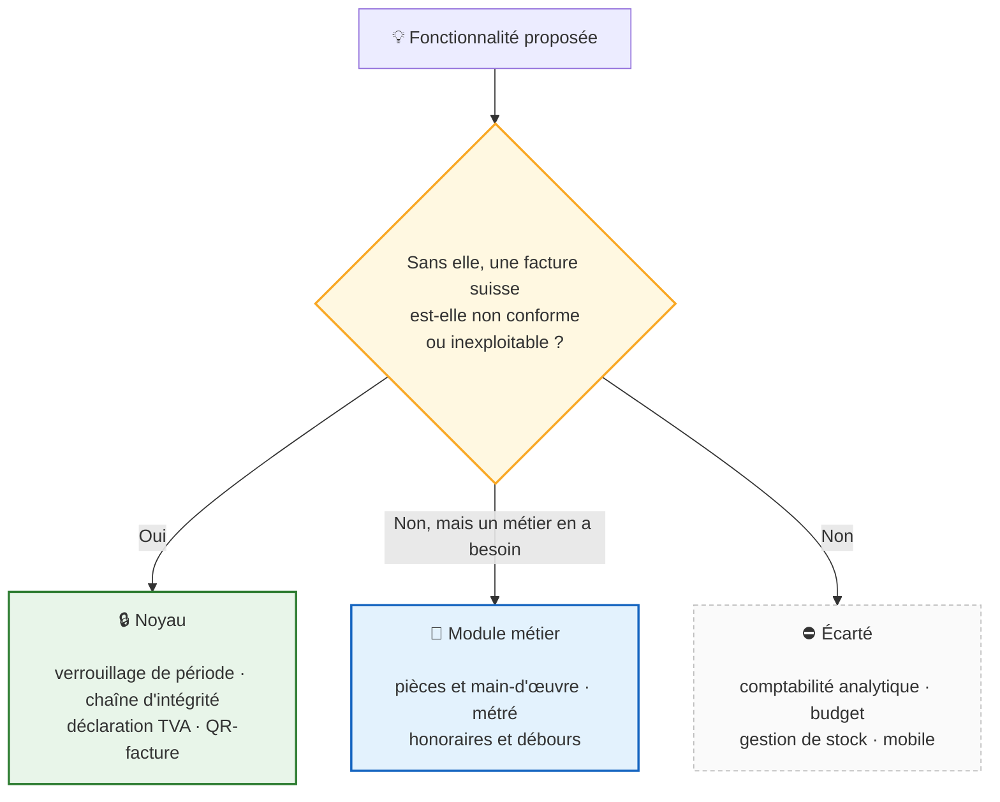
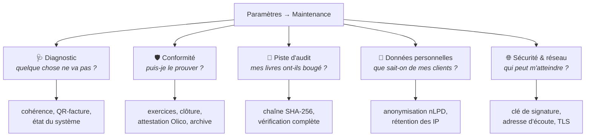
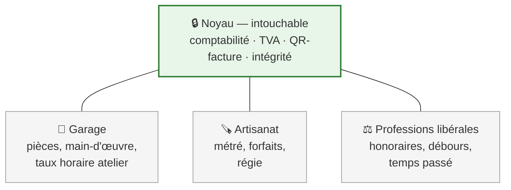

# Roadmap

**LedgerAlps est un logiciel de facturation** qui tient derrière lui la
comptabilité que la loi suisse exige d'un indépendant qui facture. Ce n'est pas
une solution comptable complète, et ce n'est pas l'objectif.

---

## Ce qui entre dans le produit, et ce qui n'y entre pas

Le risque, pour un logiciel qui marche, est de grossir vers ce que font les
concurrents. Ce critère est la réponse : il tient en une question, et il se
répond sans débat d'opinion.

---

## Où en est le produit

**Statuts.** ✅ livré **et validé par l'utilisateur** · 🔎 livré, en attente de
validation · ⏳ planifié · ⛔ bloqué, décision à prendre

> Le code écrit ne suffit pas à cocher une case. La recherche IDE répondait 403
> à tout le monde, l'archive ARM64 n'avait pas de serveur, l'empreinte
> d'intégrité ne couvrait pas les valeurs enregistrées — chaque fois les tests
> passaient, mais le chemin réellement emprunté par un utilisateur n'avait
> jamais été parcouru.

---

## Conformité suisse — état

| Obligation | Base légale | État |
|---|---|---|
| Traçabilité des écritures et des documents | CO art. 957a al. 2 ch. 5 | ✅ chaîne SHA-256 vérifiable, auteur de chaque action |
| Conservation dix ans | CO art. 958f | ✅ archive légale JSON + CSV |
| Support modifiable admis | Olico art. 9 | ✅ attestation d'intégrité exportable |
| Exercice bouclé immuable | CO art. 958f, Olico art. 3 | ✅ verrouillage de période |
| Facture nommant son destinataire | LTVA art. 26 al. 2 | ✅ identité figée à l'émission |
| Interdiction de mentionner la TVA sans l'être | LTVA art. 27 al. 1 et 2 | ✅ refusé à la source |
| Correction par note de crédit | LTVA art. 27 al. 4, art. 41 | ✅ liée, bornée, signée en déclaration |
| QR-facture | SIX IG v2.4 | ✅ conforme · ⏳ validation portail SIX |
| Sécurité des données | nLPD art. 8, OPDo art. 3 | ✅ HTTPS réseau · ✅ sauvegardes chiffrées · ✅ base chiffrable |
| Effacement et rétention | nLPD art. 6 al. 4, art. 32 | ✅ anonymisation, purge des IP |
| Portabilité | nLPD art. 25 et 28 | ✅ export par client, archive complète |

---

## Priorités

| # | Sujet | État | Détail |
|---|---|---|---|
| 1 | Factures fournisseurs & charges | 🔎 livré | [↓](#1--factures-fournisseurs--charges) |
| 1b | Ordre de paiement pain.001 | 🔎 livré | [↓](#1b--ordre-de-paiement-pain001) |
| 2 | Sauvegarde & restauration | ✅ | [↓](#2--sauvegarde--restauration) |
| 3 | Limitation des tentatives de connexion | ✅ | — |
| 4 | Chiffrement au repos | ✅ | [↓](#4--chiffrement-au-repos) |
| 4b | Durée de vie des sessions | ✅ | [↓](#4b--durée-de-vie-des-sessions) |
| 5 | HTTPS natif | 🔎 réseau à valider | [↓](#5--https-natif) |
| 6 | Rotation du secret de signature | ✅ | [↓](#6--rotation-du-secret-de-signature) |
| 7 | Maintenance & Système | ✅ conforme | [↓](#7--maintenance--système) |
| 7b | Journal et plan comptable | ✅ | [↓](#7b--journal-et-plan-comptable) |
| 8 | Notes de crédit — écriture au journal | 🔎 livré, éteint par défaut | [↓](#8--notes-de-crédit--écriture-au-journal) |
| 9 | Multi-utilisateurs & permissions | ✅ | [↓](#9--multi-utilisateurs--permissions) |
| 9b | Second facteur & réinitialisation d'accès | ✅ | [↓](#9b--second-facteur--réinitialisation-daccès) |
| 10 | Rapprochement bancaire (interface) | ✅ | [↓](#10--rapprochement-bancaire) |
| 11 | eBill | ⛔ écarté — réseau fermé | [↓](#11--ebill) |
| 12 | Validation contre le portail SIX | 🔎 dossier livré | [↓](#12--validation-contre-le-portail-six) |
| 12b | Exports comptables (journal, grand livre, balance) | 🔎 livré | [↓](#12b--exports-comptables) |
| 9c | Droits du comptable, second facteur par rôle, lecture seule | ✅ | [↓](#9c--droits-du-comptable-et-second-facteur-par-rôle) |
| 13 | Veille de conformité automatisée | ✅ | — |
| 13b | Lecture d'une facture fournisseur (QR + texte) | ✅ | [↓](#13b--lecture-automatique-des-factures-fournisseurs-pdf) |
| 13c | Traçabilité : couverture du journal et attestation automatique | 🔎 livré | [↓](#13c--traçabilité) |
| 13d | Retirer une facture de la liste des paiements | 🔎 livré | [↓](#13d--vider-la-liste-des-paiements) |
| 14 | **Modules métier** | 💡 à trancher | [↓](#14--modules-métier) |

---

## Détails

### 1 — Factures fournisseurs & charges

**Livré.** L'API existait depuis longtemps — lignes multi-taux, garde
anti-doublon, impôt préalable alimentant le chiffre 400 de la déclaration — mais
sans interface : saisir une facture fournisseur demandait de forger une requête
HTTP, c'est-à-dire que la fonction n'existait pas pour les gens à qui ce produit
s'adresse. L'écran **Achats** la porte désormais.

**L'écriture au journal manquait aussi.** Le statut « comptabilisée » l'annonçait
depuis l'origine — le schéma dit « posted to the journal, counts for VAT » — mais
rien ne l'écrivait : la charge n'entrait dans les livres que si quelqu'un la
saisissait à la main, pendant que la TVA déductible alimentait déjà la
déclaration. Les livres et la déclaration racontaient deux histoires. La
comptabilisation écrit maintenant charge + TVA déductible au débit, créanciers au
crédit, et scelle l'écriture. Vérifié sur un serveur réel : trois lignes, comptes
6500 / 2262 / 2000, empreinte de 64 caractères.

L'écran permet aussi de **créer un fournisseur sur place** — renvoyer vers
Contacts au milieu d'une saisie fait perdre ce qui est déjà tapé — et propose
les taux de TVA en liste fermée, parce qu'un 8.0 au lieu de 8.1 ne se découvre
qu'au décompte trimestriel.

**Reste** : notes de frais et pièces jointes.

### 1b — Ordre de paiement pain.001

**Livré.** L'export existait, mais il fallait décrire chaque virement à la main
dans un corps JSON — l'écran le disait sans détour : « exportez via l'API
POST /api/v1/payments/export ». Autant dire que la fonction n'existait pas.

L'écran **Achats** liste les factures fournisseurs comptabilisées, on coche
celles à régler, et LedgerAlps produit le fichier XML à déposer dans l'e-banking.
Rien ne sort de la machine : le fichier est téléchargé, pas transmis.

**Les montants ne viennent pas du navigateur.** La sélection ne transmet que des
identifiants ; le créancier, l'IBAN, le montant et la référence sont relus par le
serveur dans les livres. C'est la différence entre « payer ces factures » et
« virer ces sommes » — dans le second cas, une page web dicterait ce qui part à
la banque.

**Générer n'est pas payer.** Aucun statut ne bouge : la facture reste
« comptabilisée » jusqu'à ce que le débit apparaisse au relevé, ce qu'établit le
rapprochement camt.053 (point 10). Marquer « payée » à la génération affirmerait
ce que rien ne soutient.

**Deux corrections de conformité au passage.** Le niveau de service « SEPA »
était annoncé sur tous les paiements, y compris en francs vers un IBAN suisse —
il ne concerne que les virements en euros dans l'espace SEPA et exposait au
rejet. Et la référence QR était écrite dans `<Cd>`, réservé à la liste de codes
externes ISO où « QRR » ne figure pas ; elle passe en `<Prtry>`, `SCOR` restant
en `<Cd>`. La règle QRR ⇔ QR-IBAN (SIX IG v2.4 §4.2.2) est vérifiée avant
l'export : l'inadéquation entre référence et IBAN est la première cause de rejet
bancaire, et le refus nomme la facture et le fournisseur à corriger.

**Reste** : la confirmation par le portail de validation SIX (point 12).

### 2 — Sauvegarde & restauration

Instantané `VACUUM INTO`, automatique au démarrage et à la demande, chiffrable.
La restauration est *préparée* puis appliquée au redémarrage : un serveur ne peut
pas échanger sous lui le fichier qu'il a ouvert. Annulable ; la comptabilité
remplacée est sauvegardée **à la préparation**, avec la même phrase de passe.

**Reste** : sauvegarde vers un dossier externe (NAS, clé USB), test de
restauration planifié.

### 4 — Chiffrement au repos

Trois protections distinctes. Les confondre conduit à en activer une et à se
croire couvert pour les trois.

| | Protège | État |
|---|---|---|
| **Chiffrement du disque** (BitLocker, LUKS) | Tout le poste | ✅ conseil rendu applicable — édition Windows détectée, marche à suivre affichée |
| **Sauvegardes** (Argon2id + XChaCha20) | La copie qui voyage | ✅ chiffrées dès qu'une phrase de passe est enregistrée |
| **Base de données** (VFS adiantum) | Le fichier, même copié ailleurs | ✅ proposée à l'installation, activable ensuite |

**Validé par l'utilisateur.** Les trois protections sont livrées et vérifiées.

**Le trou réel n'était pas celui du roadmap.** Les sauvegardes automatiques
n'étaient chiffrées que si la variable d'environnement `BACKUP_PASSPHRASE`
existait — c'est-à-dire jamais. Mesuré sur une installation réelle : jusqu'à
quatorze copies complètes de la comptabilité, en clair, dans le dossier qu'on
copie justement sur un NAS. En-tête SQLite, numéro de TVA, adresses e-mail et
IBAN lisibles sans aucune clé.

**Le chiffrement de la base n'était pas impossible, mais mal diagnostiqué.** Le
blocage n'était pas SQLCipher — c'était le pilote : le paquet `vfs` de
`modernc.org/sqlite` est en lecture seule, donc rien ne pouvait s'insérer
dessous. `github.com/ncruces/go-sqlite3` expose un VFS écrivable et livre
`vfs/adiantum`, en Go pur, `CGO_ENABLED=0` conservé. Coût mesuré : +0,36 ms par
requête, +64 Mo de mémoire, +2,4 Mo de binaire.

**Ce que le chiffrement de la base ajoute au disque chiffré** : une seule chose,
et c'est pour elle qu'il existe — la protection *suit le fichier*. Une base
copiée sur un NAS ou dans un dossier synchronisé reste illisible. Contre le vol
du poste, BitLocker suffit ; il reste donc le premier conseil, et le chiffrement
de la base s'adresse à ceux qui ne peuvent pas l'activer.

**Ce qu'il n'ajoute pas** : rien contre un programme lancé sous le même compte
Windows. Il peut demander la clé exactement comme LedgerAlps le fait.

**La règle qui a décidé la conception** : chiffrer introduit une façon nouvelle
de perdre dix ans de pièces (CO art. 958f). La clé est donc scellée au compte
Windows *et* enveloppée dans une phrase de récupération obligatoire ; les
sauvegardes ne dépendent jamais de la clé machine ; et si la clé devient
illisible, LedgerAlps démarre en mode récupération plutôt que de refuser de
démarrer. Ce dernier point manquait, et le logiciel était irrécupérable —
constaté en effaçant le coffre sur un serveur réel.

**La protection se choisit à l'installation.** L'assistant demande les deux
phrases après l'entreprise, et pose les clés *avant* que le serveur démarre : la
base naît chiffrée, sans conversion ni redémarrage, et la première sauvegarde
automatique est déjà chiffrée. Le panneau de réglage subsiste mais change de
forme une fois le chiffrement en place — il sert à l'entretenir, pas à le
proposer. Le retirer aurait laissé sans recours les installations antérieures à
l'assistant, et ceux qui ont décliné.

**Reste** : rien d'obligatoire. Le chiffrement de colonnes a été écarté — les
données comptables ne sont pas des « données sensibles » au sens de la nLPD
art. 5 let. c, et on paierait la recherche et les tris pour peu.

### 4b — Durée de vie des sessions

Deux réglages qui bornent la même chose par deux chemins, et qu'il faut donc
regarder ensemble : en durcir un seul donne l'illusion d'une protection.

| | Défaut | Réglable |
|---|---|---|
| **Déconnexion après inactivité** | 10 minutes | 2 min à 1 h, ou jamais |
| **Régénération de la clé de signature** | chaque jour, au démarrage | jour / semaine / mois, ou jamais |

Dix minutes et pas cinq, parce qu'aucun brouillon n'est enregistré : lire une
facture fournisseur avant de la saisir prend plus de cinq minutes sans qu'une
touche soit frappée, et un délai qui coupe pendant la lecture est un délai qu'on
désactive — ce qui laisse la session ouverte indéfiniment. Une minute
d'avertissement précède la coupure, avec un bouton pour rester.

La clé tourne **au démarrage seulement**. Sur une minuterie, elle déconnecterait
au milieu d'une saisie ; au démarrage, elle ne coûte qu'une reconnexion. Le
bouton manuel reste pour la fuite dont on vient de s'apercevoir, qu'aucune
périodicité ne couvre.

### 5 — HTTPS natif

Le serveur écoute par défaut sur `127.0.0.1`. Le rendre joignable depuis un autre
poste (`HOST`) impose TLS : certificat fourni, sinon auto-signé généré et
**réutilisé d'un démarrage à l'autre**, pour que l'exception accordée au
navigateur tienne.

Une option servant aussi en HTTPS sur `localhost` a été proposée puis **retirée** :
aucune sécurité gagnée — le trafic ne quitte pas la machine — pour un
avertissement de certificat à chaque profil de navigateur. Dépenser la confiance
dans les avertissements sans rien protéger est un mauvais échange.

**Reste** : renouvellement automatique du certificat, HSTS.

### 6 — Rotation du secret de signature

Bouton dans **Maintenance → Sécurité**, administrateurs. La confirmation énonce
la portée exacte : cela déconnecte toutes les sessions **et rien d'autre** —
mots de passe intacts, aucune donnée touchée, sauvegardes utilisables.

Ne remplace pas le chiffrement du disque : qui lit `config.json` lit aussi
`ledgeralps.db`, dans le même dossier.

### 7 — Maintenance & Système

**Conforme.** Cinq sections, découpées par la question à laquelle chacune répond.

Trois défauts de fond ont été trouvés en construisant cet écran, tous corrigés :

| Défaut | Conséquence réelle |
|---|---|
| L'empreinte ne couvrait pas les valeurs enregistrées | aucune écriture ne pouvait se revérifier, **depuis l'origine** |
| `fiscal_year_id` n'était renseigné nulle part | la clôture répondait « close » **sans produire d'écriture de clôture** |
| L'écriture de clôture échappait à la chaîne | la pièce qui vire le résultat était la seule hors CO art. 957a |

**Ce qui reste n'est pas une question de conformité** — la loi n'exige aucun de
ces points, et une déclaration TVA se dépose valablement à la main :

- **Mode bac à sable** — duplication vers un environnement de test. ⚠️ Exige un
  marquage impossible à ignorer : le risque n'est pas technique mais humain,
  facturer un vrai client depuis le bac à sable.
- **Console de rejeu ISO 20022** — import et export existent ; le rejeu, non.
- **Console de logs** — l'état du système est livré ; la consultation des erreurs
  API demande une capture de journal qui n'existe pas.
- **Transmission e-TVA** — les taux et les deux méthodes sont en place et
  vérifiés ; seule la télétransmission manque.

⚠️ **Le recalcul des soldes reste volontairement absent.** Cet écran montre, il
ne répare pas : une comptabilité incohérente se corrige par une écriture, pas par
un bouton — réparer en silence effacerait la trace (CO art. 957a al. 2 ch. 5).

### 7b — Journal et plan comptable

**Réparés.** Ces deux écrans ne fonctionnaient pas — pas à moitié, pas du tout —
et l'un des défauts touchait les états financiers eux-mêmes.

**Le plus grave : les brouillons comptaient.** Une écriture jamais
comptabilisée, donc scellée par rien et encore modifiable, apparaissait dans la
balance, au bilan et au compte de résultat. La condition `status = 'posted'`
était portée par une jointure externe, qui décide si l'écriture est *rattachée*
et non si la ligne est *retenue*. Les états s'affichaient normalement, simplement
faux. Vérifié sur un serveur réel avant et après ; trois tests le tiennent
fermé.

**Le journal ne pouvait rien enregistrer.** Le formulaire envoyait
`debit_account` / `credit_account` / `amount` là où l'API attend un compte et un
montant au débit ou au crédit, et une seule ligne là où une écriture en comporte
au moins deux : chaque saisie répondait 422. La liste, elle, ne demandait rien au
serveur — sa source était un tableau vide en dur.

**Le plan comptable lisait des champs inexistants.** La colonne des numéros
lisait `number` là où l'API rend `code` : vide sur les quatre-vingt-un comptes.
La balance lisait `account_number` / `debit` / `credit` : entièrement à « — ».
Les types TypeScript décrivaient fidèlement une API qui n'existait plus, donc
rien ne pouvait le signaler à la compilation.

**Ce qui a été livré au passage** : les comptes se désignent par leur numéro avec
le nom affiché pendant la frappe ; les totaux et l'écart se calculent en direct ;
la liste rend le montant et l'auteur ; une ligne se déplie sur son détail avec
l'empreinte qui la scelle ; les refus nomment la ligne et la cause, écart
compris. La balance masque les comptes sans mouvement, calcule son total et
annonce l'équilibre.

**Reste** : le journal ne se filtre pas encore par date ou par compte depuis
l'interface — l'API le permet déjà. À faire quand un dossier réel comptera
assez d'écritures pour que ce soit gênant.

### 8 — Notes de crédit — écriture au journal

**Livré.** Une facture envoyée passe au journal : débiteurs au débit du total
TTC, produits au crédit du hors-taxe, TVA due au crédit du reste. La note de
crédit contrepasse à l'identique. La ligne de TVA est omise quand il n'y en a
pas — une ligne à zéro n'est pas une information.

L'ordre était imposé, et c'est pourquoi ce point attendait : contrepasser le
produit d'une note alors que la facture n'a jamais été passée créerait un
produit négatif sans contrepartie.

**Éteint sur les installations existantes, et c'est délibéré.** Qui tenait une
comptabilité complète saisissait ces écritures à la main ; les automatiser
d'office doublerait le produit et la TVA due sur tout un exercice. La migration
éteint le réglage pour les fiches déjà présentes et le laisse actif pour celles
créées ensuite. À allumer dans Paramètres → Facturation, après vérification.

L'idempotence tient au lien `journal_entry_id` : un document déjà rattaché à une
écriture n'en produit pas une seconde, quel que soit le nombre de clics.

**Reste** : l'écriture des factures fournisseurs, qui suit le même mécanisme en
sens inverse.

### 9 — Multi-utilisateurs & permissions

**Livré.** Trois rôles, et le cas central est celui de la fiduciaire : lui ouvrir
les livres sans lui donner les clés.

| Rôle | Peut | Ne peut pas |
|---|---|---|
| **Administrateur** | tout | — |
| **Comptable** | tenir les livres, facturer, encaisser | comptes, sauvegardes, sécurité |
| **Lecture seule** | consulter, exporter | écrire quoi que ce soit |

**Le rôle est lu dans la base à chaque requête, jamais dans le jeton.** C'est la
décision qui porte tout le reste. Un jeton d'accès vit une heure ; si le rôle y
était inscrit, rétrograder ou désactiver quelqu'un le laisserait agir avec ses
anciens droits pendant tout ce temps — une heure durant laquelle on croit avoir
coupé l'accès. La base est locale, la lecture est un accès par clé primaire : le
coût est nul, et toute une classe de privilèges périmés disparaît. Vérifié sur
un serveur réel : avec le **même** jeton, 403 → 201 → 403 au fil des
changements de rôle, sans aucune reconnexion.

`RequireAdmin`, qui lisait le drapeau dans le jeton, a été **supprimé** plutôt
que déprécié : laissé disponible, il serait repris par réflexe sur la prochaine
route d'administration.

**Deux barrières indépendantes.** Les permissions déclarées par route dépendent
de ce qu'on a pensé à écrire ; oublier une déclaration sur une nouvelle route
est la façon la plus courante d'ouvrir un trou, parce que rien ne le signale. Un
filtre global refuse donc toute méthode d'écriture à un rôle en lecture seule,
quelle que soit la route — y compris celles qui n'existent pas encore.

**Trois refus protègent l'installation d'elle-même** : on ne retire pas le
dernier administrateur (ni en le rétrogradant, ni en le désactivant), et on ne
change pas son propre rôle. Sans cela, un clic rend l'installation
inadministrable, et il n'y a aucun mot de passe de secours derrière.

Un compte se **désactive**, il ne se supprime pas : les écritures portent
l'identifiant de leur auteur, et l'effacer romprait la traçabilité du
CO art. 957a al. 2 ch. 5.

**Sauvegardes et Maintenance sont refusées à la lecture seule, en lecture aussi.**
Vérifié sur un serveur réel : `/backups`, `/backups/policy`,
`/database/encryption`, `/maintenance/*`, `/settings/server`,
`/settings/security`, `/security-events`, `/users` et `/audit-logs` répondent
403 ; l'import camt.053, la création de contact, de facture et d'écriture aussi.
Les onglets correspondants ne sont pas seulement masqués — ils ne sont pas
rendus, et une adresse tapée à la main se recale sur un onglet autorisé.

Masquer sans interdire ne protège de rien ; interdire sans masquer use la
confiance dans l'interface. Il faut les deux, et c'est le serveur qui décide.

**Le compte en cours est annoncé en permanence**, en bas du menu, avec ce que le
rôle implique plutôt que son seul nom. « Compte ADMINISTRATEUR — ne pas utiliser
pour le travail courant » n'est pas une politesse : un compte administrateur
laissé ouvert sur un poste partagé est la porte que personne ne pense à fermer.

**Reste** : rien d'obligatoire. Des permissions plus fines — un comptable sans
accès à la TVA, par exemple — attendront qu'un besoin réel les demande.

### 9b — Second facteur & réinitialisation d'accès

**Livré.** Deux manques que le point 9 laissait ouverts : le compte
administrateur n'était protégé que par un mot de passe, et un mot de passe
oublié n'avait aucune issue — le produit refusant de supprimer un compte.

**Second facteur par code à usage unique (TOTP, RFC 6238), obligatoire pour les
administrateurs.** Un compte administrateur peut créer des comptes, restaurer
une sauvegarde, déverrouiller une période et déchiffrer la base. Un mot de passe
réutilisé sur un autre site, deviné ou lu par-dessus l'épaule suffisait.

Ce qu'il protège : le cas où le **mot de passe** fuit. Ce qu'il ne protège pas :
quelqu'un qui lit déjà le fichier de base — le secret y est, et celui-là n'a
besoin d'aucun code. C'est le chiffrement de la base et du disque (point 4) qui
répond à cette menace, pas celui-ci.

TOTP plutôt qu'autre chose : le SMS demande un opérateur et un appel sortant, le
courriel protège mal la boîte qui est souvent la cible, WebAuthn exige HTTPS et
du matériel. TOTP fonctionne hors ligne, avec n'importe quelle application — y
compris libre : Aegis, KeePassXC, FreeOTP — et aucun tiers n'est dans la boucle.
L'algorithme est écrit ici, pas importé : quarante lignes, vérifiées contre les
**vecteurs de test officiels de la RFC 6238**.

Vérifié sur un serveur réel : un administrateur non inscrit reçoit 403 sur
`/users`, `/backups`, `/contacts`, `/invoices` et `/journal`, lecture comprise.
Le jeton d'attente délivré après le mot de passe vit cinq minutes, ne vaut que
pour `/auth/mfa/verify`, et le filtre d'authentification le refuse partout
ailleurs — donc aussi sur les routes qui n'existent pas encore. Un code ne sert
qu'une fois. La vérification est derrière la limitation de tentatives existante.

**Dix codes de secours, montrés une fois, hachés en base.** Sans eux, la perte
de l'application d'authentification enfermerait définitivement le dernier administrateur : le second
facteur créerait la panne qu'il est censé prévenir.

**Réinitialisation d'accès par l'administrateur.** « Réinitialiser » remplace le
mot de passe — jamais révélé, pas même à l'administrateur — par un mot de passe
temporaire tiré au hasard, affiché une seule fois et absent du journal de
sécurité. Le compte devra en choisir un autre à sa connexion suivante et ne peut
rien faire avant. Les sessions ouvertes tombent.

Elle ne retire **pas** le second facteur. Réunis en un seul geste, les deux
permettraient à un administrateur de se substituer entièrement à n'importe quel
compte, et le second facteur ne protégerait plus de rien face à lui. Le retrait
est une action séparée, confirmée et tracée à part.

**À la première connexion après la mise à jour**, l'administrateur d'une
installation existante devra activer le 2FA avec une application
d'authentification OTP avant de pouvoir travailler. C'est voulu : une protection qu'on peut remettre à plus tard n'est
jamais activée.

**Reste** : rien d'obligatoire. Une clé matérielle (WebAuthn) attendrait HTTPS
généralisé et un besoin réel.

### 9c — Droits du comptable et second facteur par rôle

**Livré.** Le rôle comptable ne pouvait pas faire son métier : clôturer un
exercice, vérifier la chaîne d'empreintes, prendre une sauvegarde, répondre à une
demande d'effacement, régler la fiche entreprise — tout cela lui était refusé.
Il devait demander à quelqu'un dont le rôle est de gérer des mots de passe.

La frontière est désormais celle-ci : **PermManage administre la COMPTABILITÉ,
PermAdmin administre le LOGICIEL et QUI Y ACCÈDE.** Le comptable a la première,
l'administrateur les deux.

**Neuf gardes internes lisaient le drapeau du JETON**, pas le rôle en base —
attestation, journal d'audit (trois fois), anonymisation, exercices (trois fois),
contacts. Le défaut que l'Authorizer avait été construit pour supprimer
subsistait donc dans les handlers : rétrograder quelqu'un le laissait agir
jusqu'à l'expiration de son jeton. Elles sont retirées ; la permission est
déclarée sur la route et lue dans la base à chaque requête. Deux tests vérifient
que ces routes portent bien leur permission — sans quoi retirer le middleware les
ouvrirait à tout compte connecté sans que rien ne le signale.

**Le second facteur suit maintenant le pouvoir de modifier.** Exigé de
l'administrateur *et* du comptable — un mot de passe volé sur l'un ou l'autre
permet de fabriquer une comptabilité. La lecture seule en est dispensée : elle ne
peut rien modifier, et c'est le rôle qu'on donne à sa fiduciaire, à qui l'on ne
dicte pas son équipement.

**« Se souvenir de cet ordinateur », trente jours.** Redemander un code chaque
jour sur le poste habituel n'ajoute presque rien — quelqu'un qui a déjà la main
sur la machine n'attend pas la prochaine connexion — et une protection vécue
comme une brimade finit désactivée. La date est **absolue** : se connecter ne la
prolonge pas, sans quoi l'exception deviendrait la règle. Le jeton est haché en
base, le navigateur en garde l'unique copie dans un cookie HttpOnly, et changer
de mot de passe ou de second facteur oublie tous les postes.

Inventaire complet des droits : [docs/DROITS.md](docs/DROITS.md).

### 10 — Rapprochement bancaire

**Livré.** L'import camt.053 existait mais ne gardait rien : le relevé était
analysé, renvoyé au navigateur, puis oublié. Impossible de savoir ce qui avait
déjà été traité, et réimporter le relevé du mois obligeait à tout revoir.

Les écritures sont désormais conservées, avec au plus une suggestion chacune et
la raison qui l'a désignée :

| Règle | Confiance | Pourquoi |
|---|---|---|
| Référence du bulletin | certaine | recopiée par la banque — une correspondance, pas une ressemblance |
| Montant exact, une seule facture ouverte | probable | fiable *tant qu'un seul candidat répond* |
| Plusieurs factures au même montant | *rien n'est proposé* | désigner la première serait un tirage au sort présenté comme une analyse |

**Rapprocher n'encaisse pas**, et c'est la décision structurante. Identifier un
versement et enregistrer un paiement restent deux gestes : le second se fait
depuis la facture, par le chemin déjà éprouvé. Solder une créance parce qu'un
montant correspondait est une erreur qu'on ne découvre qu'en relançant un client
qui a déjà payé — ou en ne relançant jamais celui qui n'a pas payé.

La réimportation ne duplique rien : chaque écriture porte une empreinte
combinant date, montant et références. La référence bancaire seule ne suffisait
pas — toutes les banques ne la renseignent pas — et le montant seul non plus :
deux versements identiques le même jour existent, et les fondre ferait
disparaître un encaissement.

**Reste** : créer le paiement depuis l'écran de rapprochement, une fois le geste
éprouvé sur des relevés réels.

### 11 — eBill

**Écarté sous la forme « LedgerAlps envoie vos factures eBill ».** Le réseau
n'est pas ouvert, et l'obstacle n'est pas technique.

Vérifié sur la spécification publique de SIX : eBill n'est pas un format qu'on
produit, c'est une **API REST OAuth 2.0 exposée par un « Network Partner »** —
un prestataire sous contrat avec SIX. Il faut :

- un contrat entre **votre entreprise** et un Network Partner ;
- un identifiant émetteur (*biller PID*) attribué par lui ;
- des jetons OAuth, contre son propre serveur.

Deux conséquences. La première : LedgerAlps ne peut rien envoyer sans un contrat
qu'il n'est pas en position de signer. La seconde, plus lourde : transmettre
supposerait des **appels sortants**, ce que le produit ne fait pas — c'est la
promesse qui le définit.

**Ce que le réseau accepte, LedgerAlps le produit déjà.** La charge utile d'un
dépôt eBill est un PDF, l'en-tête `X-BCFORMAT` pouvant valoir `QRBill` : le
bulletin QR-facture que LedgerAlps imprime. Qui signe avec un Network Partner
dépose donc ce PDF, sans que LedgerAlps ait à s'y connecter.

**Reste** : rien côté produit. Si le besoin devient réel, ce sera un module au
sens du §14, pas une fonction du noyau.

### 12 — Validation contre le portail SIX

**Livré, dans la part qui revient au logiciel.** Chaque facture produit un
dossier à déposer (bouton *Validation SIX*) : le **payload exact** encodé dans
le QR, le bulletin en PDF, et la marche à suivre.

Le payload sort de la même fonction que l'impression — extraite pour cela. Deux
constructions séparées divergeraient un jour, et ce jour-là on ferait valider
autre chose que ce qu'on envoie aux clients, c'est-à-dire qu'on validerait pour
rien.

**Le compte reste à créer par vous.** Le portail en demande un ; un logiciel
n'ouvre pas de compte au nom de quelqu'un d'autre. C'est la seule part qui ne
s'automatise pas, et le dossier le dit.

Pourquoi cela compte : nos tests vérifient **notre lecture** de la
spécification, pas la conformité du bulletin produit. Ils passeraient tous avec
un contresens.

> **Il n'existe aucune « certification ISO 20022 ».** Le Registration Authority
> [l'écrit explicitement](https://www.iso20022.org/faq) : aucune autorité de
> certification n'existe pour cette norme. Ce qui existe est une
> [liste d'auto-évaluation](https://www.iso20022.org/sites/default/files/documents/D7/ISO20022_ComplianceChecklist.pdf).
> Les organismes qui vendent un « audit ISO 20022 certifiant » ne s'appuient sur
> rien. Ce qui a de la valeur en Suisse est la conformité aux Swiss Payment
> Standards de SIX.

> **Logo « QR-Ready » — non retenu.** `qr-ready.ch` est associé à Epsitec SA
> (éditeur de Crésus, concurrent), n'est pas un programme SIX, ne documente
> aucun processus de certification, et sa page redirige aujourd'hui vers une
> 404. L'afficher reviendrait à adopter la marque d'un concurrent sans
> validation vérifiable derrière.

### 12b — Exports comptables

**Livré.** Journal général, grand livre et balance de vérification en CSV, plus
l'archive légale ZIP.

Les trois premiers n'étaient **pas en panne** : c'étaient des maquettes. Boutons
désactivés, pastille « Bientôt disponible », gestionnaire vide. L'archive, elle,
annonçait une « fonctionnalité prévue dans une prochaine version » alors que sa
route existait et fonctionnait depuis des mois — il ne manquait que le bouton.

Format pensé pour l'outil qui ouvrira le fichier : séparateur point-virgule et
BOM UTF-8, sans quoi Excel en configuration suisse produit une colonne unique et
casse les accents. Chaque fichier porte une ligne de total, qui est ce qui permet
de repérer un export tronqué.

Ce sont des **lectures** : un compte en lecture seule peut les produire. C'est la
raison d'être de ce rôle — remettre les livres à sa fiduciaire sans lui donner
les clés.

**Reste** : rien d'obligatoire. Un format destiné à un logiciel fiduciaire précis
(Abacus, Crésus) attendra qu'un besoin réel le demande.

### 13b — Lecture automatique des factures fournisseurs (PDF)

**Tranché.** Saisir une facture reçue à la main est le geste le plus répétitif du
produit. Trois voies avaient été étudiées ; **les deux premières sont livrées**,
la troisième reste écartée pour la raison expliquée plus bas. L'analyse qui a
mené à ce choix est conservée ci-dessous — elle dit ce que chaque voie coûte.

**1. La QR-facture, d'abord.** Une facture suisse conforme porte un QR code qui
contient déjà, en clair et sans ambiguïté : l'IBAN du créancier, son nom, son
adresse, le montant, la devise et la référence de paiement. Aucune
reconnaissance de caractères n'est nécessaire — il suffit de trouver l'image dans
le PDF et de la décoder. Les bibliothèques existent en Go (`gozxing`,
licence Apache 2.0). **Fiabilité proche de 100 % quand le code est présent**, ce
qui est le cas de la grande majorité des factures suisses depuis le
30 septembre 2022. C'est de loin le meilleur rapport résultat/risque, et cela ne
lit que ce que la norme SIX définit — donc rien à deviner.

**2. Le texte du PDF, pour le reste.** Numéro de facture, date, montants hors
taxe et taux de TVA se trouvent dans la couche texte d'un PDF produit par un
logiciel de facturation. `pdfcpu` (Apache 2.0) ou `ledongthuc/pdf` (BSD)
extraient ce texte en Go pur, sans dépendance système. Des expressions régulières
et quelques heuristiques suffisent pour proposer des valeurs — **à confirmer par
l'utilisateur, jamais à enregistrer d'office.**

**3. L'OCR, seulement pour les scans.** Une facture photographiée n'a pas de
couche texte. Tesseract (Apache 2.0) sait la lire, mais impose une dépendance
native — donc `CGO_ENABLED=1`, ce qui casse le binaire unique sans configuration
qui est la promesse du produit. À réserver à une version ultérieure, en option
détectée si Tesseract est déjà installé.

**Ce qui est exclu.** Tout service d'extraction en ligne, toute API de modèle de
langage hébergée : une facture fournisseur contient l'IBAN, le nom et l'adresse
d'un tiers, et l'envoyer chez un prestataire contredit frontalement la promesse
de souveraineté. Un modèle local (Ollama) reste envisageable, mais pèse plusieurs
gigaoctets pour un gain incertain face au QR code.

### Ce qui est livré — la voie 1

**Livré.** On dépose le PDF depuis l'écran Achats, LedgerAlps décode le
QR-facture et pré-remplit le fournisseur (reconnu **par son IBAN**), la référence
de paiement et le numéro de la pièce. Le contrôle référence QR ⇔ QR-IBAN est
appliqué à la lecture, donc bien avant qu'un paiement parte.

Vérifié sur un serveur réel avec un PDF portant un vrai QR : créancier, IBAN,
montant, référence et type de référence tous relus correctement, fournisseur
connu reconnu, **et aucune facture créée** — la route lit, elle n'écrit pas.

Deux dépendances, toutes deux en Go pur : `gozxing` et `pdfcpu`, Apache 2.0,
`CGO_ENABLED=0` conservé.

**Ce qui n'est pas couvert, et le dit** : une facture sans QR, ou dont le QR est
tracé en vecteurs plutôt qu'en image. La réponse est « aucun QR trouvé » avec
l'explication, jamais un formulaire vide sans raison.

### La voie 2 aussi

**Livrée.** La couche texte du PDF apporte ce que le QR ne porte pas : numéro de
facture, date, échéance, taux de TVA, numéro IDE du fournisseur.

**La lecture est géométrique, pas textuelle.** Un chiffre ne veut rien dire sans
son étiquette : « 538690 » est un numéro de facture parce qu'il est écrit sous la
colonne « Numéro de facture ». On lit donc chaque fragment avec ses coordonnées,
on reconstitue des lignes, et on rattache une valeur à son étiquette par la
position — comme un humain lit une facture.

**Deux pièges réels, trouvés sur une facture réelle :**

*Deux dates portent l'étiquette « Date »* sur un rappel — celle du rappel et
celle de la facture rappelée. La lecture porte sur la **ligne** du tableau : le
numéro, sa date et son échéance viennent de la même rangée.

*Les colonnes de nombres sont alignées à droite*, si bien que leur abscisse tombe
sous l'en-tête précédent et décale toute la ligne d'un cran. Chaque valeur reste
juste, chaque étiquette devient fausse — le pire des cas, puisque rien ne cloche
à l'œil. L'appariement se fait par rang, et un contrôle de cohérence refuse
l'assignation décalée.

**Chaque valeur voyage avec sa provenance**, affichée à l'écran. Rien n'est
enregistré sans confirmation.

**Reste** : les factures scannées, sans couche texte. Elles demanderaient un
rendu de page et une reconnaissance de caractères, donc une dépendance native —
ce qui casserait le binaire unique. Le refus est explicite.

**Recommandation initiale, conservée pour mémoire** : la voie 1 seule pour commencer — décoder le QR d'une
facture déposée, pré-remplir créancier, IBAN, montant et référence de paiement,
et laisser l'utilisateur compléter le reste. C'est peu de code, aucune dépendance
native, aucun risque d'erreur silencieuse, et cela couvre le cas courant. La voie
2 s'ajoute ensuite si le besoin se confirme.

**Aucune valeur ne doit être enregistrée sans confirmation.** Une facture
fournisseur mal lue entre dans les livres et dans la déclaration de TVA ; un
champ pré-rempli qu'on relit vaut mieux qu'un champ juste qu'on n'a pas vu.

### 13c — Traçabilité

**Livré.** La chaîne d'empreintes du CO art. 957a existait, avec sa vérification
et son attestation. **Trois actions y entraient** : la comptabilisation d'une
écriture, la clôture d'un exercice, le changement de statut d'une facture. Les
constantes `ActionContactUpdated`, `ActionPaymentRecorded`,
`ActionBankEntryMatched` étaient déclarées et jamais appelées.

Un journal à trous est pire qu'un journal absent : on le consulte en croyant
qu'il dit tout, et l'absence d'une ligne se lit comme « cela n'a pas eu lieu »
alors qu'elle veut dire « cela n'a jamais été écrit ».

**Ce qui entre désormais dans la chaîne** : création, modification,
comptabilisation, annulation et suppression d'une facture fournisseur ;
modification des coordonnées de l'entreprise — c'est l'IBAN qui reçoit les
virements de tous les clients ; et les refus, pas seulement les succès. Un refus
non tracé laisse sans réponse la question qui vient après : « on a bien essayé,
pourquoi est-ce encore là ? »

**L'attestation s'émet seule**, au démarrage puis chaque jour, dans
`attestations/` à côté des sauvegardes. La chaîne rend une modification
détectable **à condition d'avoir un point de comparaison** : qui peut écrire
dans la base peut recalculer la chaîne entière, qui reste alors cohérente.
L'ancrage est l'empreinte de tête conservée ailleurs, à une date connue — et une
garantie qui suppose qu'on pense à cliquer chaque mois n'existe pas.

Le fichier part avec les sauvegardes vers le NAS ou la clé USB ; c'est ce
déplacement, décidé par l'utilisateur, qui vaut ancrage. **Rien n'est envoyé
nulle part** : un horodatage tiers (RFC 3161) supposerait un appel réseau,
contraire à la promesse du produit. La limite est écrite dans l'attestation
elle-même.

**Finalité déclarée** (nLPD art. 6) : traçabilité comptable et sécurité. Ce sont
des **opérations sur des pièces** qui sont enregistrées, jamais des clics ni du
temps de présence. L'OLT 3 art. 26 interdit les systèmes destinés à surveiller
le comportement des travailleurs ; ce journal n'en est pas un, et sa conception
doit le rester.

**Reste** : le fichier en ajout seul hors de la base (« lot 2 »), qui protégerait
du cas d'une restauration effaçant l'historique. Écarté pour l'instant — il
place une seconde écriture dans le chemin critique de chaque action, pour un
seul scénario.

### 13d — Vider la liste des paiements

**Livré.** La liste accumulait tout ce qui est comptabilisé et non réglé :
factures payées hors LedgerAlps, saisies d'essai, doublons. Les **factures
bloquées** — celles qui ne peuvent pas être payées faute de QR-IBAN ou de
référence valide — y restaient pour toujours, puisque rien ne les en faisait
sortir. Une liste qu'on ne peut pas vider cesse d'être lue, et le jour où elle
porte une vraie facture en retard, personne ne la voit.

**Supprimer n'était pas la réponse.** Une facture comptabilisée est une charge
dans les livres, avec sa dette au compte créanciers ; l'effacer ferait
disparaître la charge d'un exercice tenu, et le CO art. 958f impose de conserver
la pièce dix ans. Le geste juste est l'**annulation avec extourne** : la facture
reste, marquée annulée, et une écriture inverse neutralise la charge et la TVA
déductible. Un réviseur voit une correction, pas un trou.

**Un défaut corrigé au passage.** Passer une facture comptabilisée à « annulée »
ne faisait que changer son statut : l'écriture restait dans les livres et
continuait d'alimenter le résultat et la déclaration pendant que l'écran
affichait « annulée ». L'écart ne se serait vu qu'au décompte trimestriel.

Par lot ou une par une, **réservé à l'administrateur et au comptable**
(`PermWriteAccounting`). Chaque facture reçoit son propre verdict : un brouillon
est supprimé, une facture comptabilisée est extournée, une facture déjà réglée
est refusée — l'argent est parti. Neuf tests portent sur les **soldes**, pas sur
le statut : c'est le seul endroit où le défaut se voyait.

### 14 — Modules métier

**Piste retenue pour l'évolution du produit, non engagée.**

Le risque, pour un logiciel qui marche, est de grossir vers ce que font les
concurrents. La direction choisie est donc **verticale, pas horizontale** : des
modules qui ajoutent des façons de *composer une facture* propres à un métier,
sans toucher au noyau comptable.

**Trois règles pour qu'un module reste un module :**

1. **Absent sans que rien ne manque.** Une installation sans module produit des
   factures complètes et conformes.
2. **Présent sans qu'aucune règle comptable ne change.** Un module ajoute des
   lignes, pas des traitements TVA ni des comptes.
3. **Aucun champ dans le noyau.** C'est la règle qui sera difficile à tenir, et
   c'est celle qui décide si le produit reste simple. Le danger n'est pas le
   premier module : c'est le troisième, celui qui demandera « juste un petit
   champ » au centre.

**À reprendre quand un métier précis se présentera avec un besoin réel**, plutôt
qu'en imaginant ce dont un garagiste pourrait avoir envie.

---

## Écarté

**Mobile / PWA** — incompatible avec l'architecture. LedgerAlps est un binaire
local écouté sur `localhost` ; une saisie hors-ligne avec synchronisation suppose
un serveur central que le produit n'a pas, et ne veut pas avoir.

---

## Plateformes prises en charge

| Plateforme | Livrable | État |
|---|---|---|
| Windows x86-64 | `LedgerAlps_Setup_*.exe` + `.zip` | ✅ |
| Linux x86-64 | archive `.tar.gz` | ✅ *(paquets `.deb`/`.rpm` abandonnés en v1.4.5)* |
| macOS (Intel, Apple Silicon) | — | ❌ abandonné après v1.4.1 |
| Windows / Linux ARM64 | — | ❌ abandonné après v1.4.1 |

**Pourquoi.** Ces binaires étaient publiés parce que la compilation croisée en Go
ne coûte rien, pas parce qu'ils étaient testés : il n'existe ni machine macOS ni
machine ARM dans la CI ni dans le projet.

L'archive `windows_arm64` a rendu le coût concret : elle ne contenait que
`ledgeralps-cli.exe`, sans serveur ni lanceur — un outil en ligne de commande
sans rien à piloter, et ce depuis la v1.3.15. Personne ne s'en est aperçu,
précisément parce que personne ne testait.

*Publier un binaire, c'est promettre qu'il fonctionne. Deux plateformes tenues
valent mieux que six supposées.*

**Linux reste une plateforme de test** même sans paquets : la CI tourne sur
Ubuntu, c'est là que `go test -race` s'exécute — impossible en local, faute de
compilateur C — et là que les assertions de permissions de fichiers ont un sens.

**En pratique** — un PC Windows ARM utilise l'installeur x86-64, que Windows
exécute par émulation. macOS, Linux ARM et Raspberry Pi se compilent depuis les
sources (`make build`, Go 1.26+) : le code reste portable, c'est la *publication*
d'artefacts non testés qui s'arrête.

Une plateforme sera réintégrée le jour où elle sera testée en CI, pas avant.

---

## Interface multilingue

La Suisse compte quatre langues officielles.

| Langue | Code | Interface | Messages du serveur | Documents (PDF, CSV) |
|---|---|---|---|---|
| Français | `fr` | ✅ | ✅ | ✅ |
| Deutsch | `de` | 🔎 complète | ⏳ | ⏳ |
| Italiano | `it` | 🔎 complète | ⏳ | ⏳ |
| English | `en` | 🔎 complète | ⏳ | ⏳ |

**L'interface est faite** : les 36 écrans, 998 clés, avec les formats qui
suivent la langue — dates, séparateurs de milliers, noms de mois, badges de
statut — et les avis de conformité rendus par le serveur dans la langue
demandée. Le sélecteur vit dans Paramètres → Mon compte et est visible pour
tous les rôles, y compris un accès en lecture seule : une fiduciaire tessinoise
doit pouvoir lire en italien sans demander la permission.

Aucune bibliothèque : un catalogue typé, `useT()`, et un test Go qui refuse une
clé manquante, une valeur vide, un repère d'interpolation perdu **ou une valeur
restée en français**. C'est ce dernier contrôle qui compte — copier `fr.ts` en
`de.ts` compile parfaitement.

**Ce qui reste** — deux lots distincts, à décider séparément :

1. **Les messages de refus du serveur** (97 chaînes). Ils atteignent
   l'utilisateur : « aucun numéro de TVA n'est enregistré ». Ils demandent une
   négociation de langue par requête, ou un catalogue côté serveur.
2. **Les documents** : facture PDF, bulletin QR, exports CSV, attestation
   d'intégrité. La question n'est pas technique — **la langue d'une facture
   doit suivre le CLIENT**, pas l'interface de celui qui l'émet. Elle relève du
   paramètre société et de la fiche contact, pas du sélecteur de langue.

Le pack NSIS italien reste à ajouter.

---

## Historique

<b>Versions publiées</b> — cliquer pour dérouler

| Version | Apport principal |
|---|---|
| **v1.5.0** *(en préparation)* | Lecture complète d'une facture fournisseur (QR + couche texte), lecture seule réellement en lecture seule, QR-IBAN distingué de l'IBAN, traçabilité étendue et attestation d'intégrité automatique, retrait d'une facture de la liste des paiements par extourne |
| **v1.4.9** | Exports comptables réels (journal, grand livre, balance), création de fournisseur à la volée, accents du PDF |
| **v1.4.8** | Rôles et permissions, second facteur TOTP, ordinateurs de confiance, écriture au journal des factures fournisseurs |
| **v1.4.7** | Correctifs et documentation |
| **v1.4.6** | Clôture d'exercice réellement effectuée, verrouillage de période, piste d'audit vérifiable, attestation Olico art. 9, anonymisation nLPD, export CSV, rotation du secret, validation IBAN ISO 13616, factures multi-pages, garde-fous note de crédit et TVA |
| **v1.4.5** | HTTPS natif, écoute sur `127.0.0.1` par défaut, Maintenance & Système (1ʳᵉ tranche), garde-fou mécanique des avis de conformité, détection BitLocker |
| **v1.4.4** | Sauvegardes chiffrées (Argon2id + XChaCha20-Poly1305), interface de sauvegarde/restauration, notes de crédit liées et bornées |
| **v1.4.3** | Flux offre → facture : une offre entrait dans la déclaration TVA et sortait titrée « FACTURE » avec bulletin QR (LTVA art. 27 al. 2) — corrigé ; conversion conservant les deux documents |
| **v1.4.2** | Plateformes réduites à Windows et Linux x86-64 ; l'archive ARM64 ne contenait que le CLI depuis la v1.3.15 |
| **v1.4.1** | Assistant de démarrage réparé (la recherche IDE répondait 403 à tout le monde), jeton de rafraîchissement en cookie HttpOnly |
| **v1.4.0** | Veille de conformité : Fedlex (SPARQL), SIX, EUR-Lex ; avis embarqués, fonctionne hors ligne |
| **v1.3.15** | Factures fournisseurs ; l'impôt préalable alimente enfin le chiffre 400 |
| **v1.3.14** | QR-facture IG v2.4, sauvegarde/restauration CLI, limitation des tentatives de connexion |
| **v1.3.13** | QR-bill SPC 0200 v2.3 : type d'adresse K→S, croix suisse restaurée |
| **v1.3.0–v1.3.12** | Logo société, conformité QR-bill itérative, auto-remplissage IDE via ZEFIX |
| **v1.2.0** | Pipeline GoReleaser + NSIS, CLI, endpoints rapports / paiements / audit |
| **v1.1.x** | ISO 20022, export légal, lanceur Windows, frontend embarqué (`go:embed`) |
| **v1.0.0** | Réécriture Go : moteur double-entrée, chaîne SHA-256 (CO art. 957a) |

---

> **Versionnage.** `vX.Y.0` livre un milestone complet ; `vX.Y.Z` groupe les
> correctifs d'un cycle. Jamais de tag par commit isolé. Les numéros de version
> des milestones planifiés sont attribués **à la livraison**, pas à l'avance.
