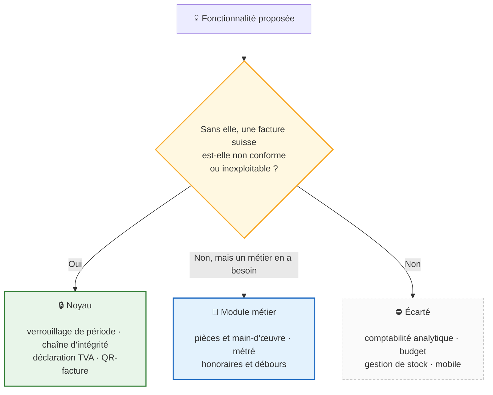
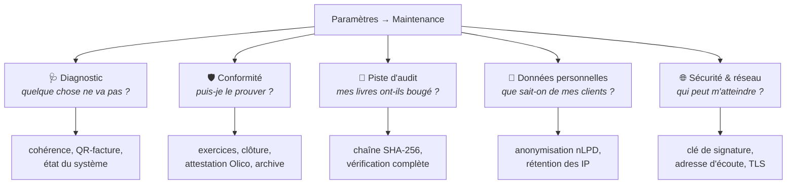
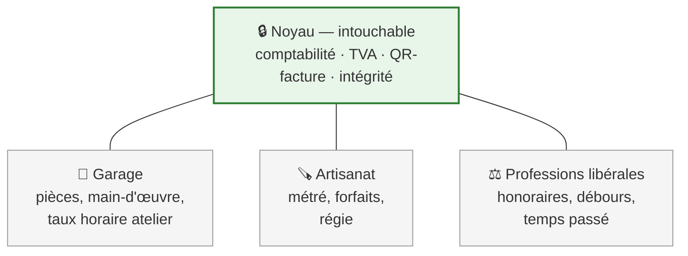

# Roadmap

**LedgerAlps est un logiciel de facturation** qui tient derrière lui la
comptabilité que la loi suisse exige d'un indépendant qui facture. Ce n'est pas
une solution comptable complète, et ce n'est pas l'objectif.

---

## Ce qui entre dans le produit, et ce qui n'y entre pas

Le risque, pour un logiciel qui marche, est de grossir vers ce que font les
concurrents. Ce critère est la réponse : il tient en une question, et il se
répond sans débat d'opinion.

---

## Où en est le produit

**Statuts.** ✅ livré **et validé par l'utilisateur** · 🔎 livré, en attente de
validation · ⏳ planifié · ⛔ bloqué, décision à prendre

> Le code écrit ne suffit pas à cocher une case. La recherche IDE répondait 403
> à tout le monde, l'archive ARM64 n'avait pas de serveur, l'empreinte
> d'intégrité ne couvrait pas les valeurs enregistrées — chaque fois les tests
> passaient, mais le chemin réellement emprunté par un utilisateur n'avait
> jamais été parcouru.

---

## Conformité suisse — état

| Obligation | Base légale | État |
|---|---|---|
| Traçabilité des écritures | CO art. 957a al. 2 ch. 5 | ✅ chaîne SHA-256 vérifiable |
| Conservation dix ans | CO art. 958f | ✅ archive légale JSON + CSV |
| Support modifiable admis | Olico art. 9 | ✅ attestation d'intégrité exportable |
| Exercice bouclé immuable | CO art. 958f, Olico art. 3 | ✅ verrouillage de période |
| Facture nommant son destinataire | LTVA art. 26 al. 2 | ✅ identité figée à l'émission |
| Interdiction de mentionner la TVA sans l'être | LTVA art. 27 al. 1 et 2 | ✅ refusé à la source |
| Correction par note de crédit | LTVA art. 27 al. 4, art. 41 | ✅ liée, bornée, signée en déclaration |
| QR-facture | SIX IG v2.4 | ✅ conforme · ⏳ validation portail SIX |
| Sécurité des données | nLPD art. 8, OPDo art. 3 | ✅ HTTPS réseau · ⛔ base en clair |
| Effacement et rétention | nLPD art. 6 al. 4, art. 32 | ✅ anonymisation, purge des IP |
| Portabilité | nLPD art. 25 et 28 | ✅ export par client, archive complète |

---

## Priorités

| # | Sujet | État | Détail |
|---|---|---|---|
| 1 | Factures fournisseurs & charges | 🔎 backend | [↓](#1--factures-fournisseurs--charges) |
| 2 | Sauvegarde & restauration | ✅ | [↓](#2--sauvegarde--restauration) |
| 3 | Limitation des tentatives de connexion | ✅ | — |
| 4 | Chiffrement au repos | 🔎 sauvegardes · 🔎 base (option) · 🔎 conseil disque | [↓](#4--chiffrement-au-repos) |
| 5 | HTTPS natif | 🔎 réseau à valider | [↓](#5--https-natif) |
| 6 | Rotation du secret de signature | ✅ | [↓](#6--rotation-du-secret-de-signature) |
| 7 | Maintenance & Système | ✅ conforme | [↓](#7--maintenance--système) |
| 8 | Notes de crédit — écriture au journal | ⏳ | [↓](#8--notes-de-crédit--écriture-au-journal) |
| 9 | Multi-utilisateurs & permissions | ⏳ | [↓](#9--multi-utilisateurs--permissions) |
| 10 | Rapprochement bancaire (interface) | ⏳ | — |
| 11 | eBill | ⏳ | [↓](#11--ebill) |
| 12 | Validation contre le portail SIX | ⏳ | [↓](#12--validation-contre-le-portail-six) |
| 13 | Veille de conformité automatisée | ✅ | — |
| 14 | **Modules métier** | 💡 à trancher | [↓](#14--modules-métier) |

---

## Détails

### 1 — Factures fournisseurs & charges

Backend livré : API, lignes multi-taux, garde anti-doublon. L'**impôt préalable**
alimente le chiffre 400 de la déclaration ; il était figé à zéro, ce qui
surévaluait la TVA due.

**Reste** : interface de saisie, écriture au journal à la comptabilisation
(charge + TVA déductible / créanciers), notes de frais, pièces jointes.

### 2 — Sauvegarde & restauration

Instantané `VACUUM INTO`, automatique au démarrage et à la demande, chiffrable.
La restauration est *préparée* puis appliquée au redémarrage : un serveur ne peut
pas échanger sous lui le fichier qu'il a ouvert. Annulable ; la comptabilité
remplacée est sauvegardée **à la préparation**, avec la même phrase de passe.

**Reste** : sauvegarde vers un dossier externe (NAS, clé USB), test de
restauration planifié.

### 4 — Chiffrement au repos

Trois protections distinctes. Les confondre conduit à en activer une et à se
croire couvert pour les trois.

| | Protège | État |
|---|---|---|
| **Chiffrement du disque** (BitLocker, LUKS) | Tout le poste | 🔎 conseil rendu applicable — édition Windows détectée, marche à suivre affichée |
| **Sauvegardes** (Argon2id + XChaCha20) | La copie qui voyage | 🔎 chiffrées dès qu'une phrase de passe est enregistrée |
| **Base de données** (VFS adiantum) | Le fichier, même copié ailleurs | 🔎 option, désactivée par défaut |

**Le trou réel n'était pas celui du roadmap.** Les sauvegardes automatiques
n'étaient chiffrées que si la variable d'environnement `BACKUP_PASSPHRASE`
existait — c'est-à-dire jamais. Mesuré sur une installation réelle : jusqu'à
quatorze copies complètes de la comptabilité, en clair, dans le dossier qu'on
copie justement sur un NAS. En-tête SQLite, numéro de TVA, adresses e-mail et
IBAN lisibles sans aucune clé.

**Le chiffrement de la base n'était pas impossible, mais mal diagnostiqué.** Le
blocage n'était pas SQLCipher — c'était le pilote : le paquet `vfs` de
`modernc.org/sqlite` est en lecture seule, donc rien ne pouvait s'insérer
dessous. `github.com/ncruces/go-sqlite3` expose un VFS écrivable et livre
`vfs/adiantum`, en Go pur, `CGO_ENABLED=0` conservé. Coût mesuré : +0,36 ms par
requête, +64 Mo de mémoire, +2,4 Mo de binaire.

**Ce que le chiffrement de la base ajoute au disque chiffré** : une seule chose,
et c'est pour elle qu'il existe — la protection *suit le fichier*. Une base
copiée sur un NAS ou dans un dossier synchronisé reste illisible. Contre le vol
du poste, BitLocker suffit ; il reste donc le premier conseil, et le chiffrement
de la base s'adresse à ceux qui ne peuvent pas l'activer.

**Ce qu'il n'ajoute pas** : rien contre un programme lancé sous le même compte
Windows. Il peut demander la clé exactement comme LedgerAlps le fait.

**La règle qui a décidé la conception** : chiffrer introduit une façon nouvelle
de perdre dix ans de pièces (CO art. 958f). La clé est donc scellée au compte
Windows *et* enveloppée dans une phrase de récupération obligatoire ; les
sauvegardes ne dépendent jamais de la clé machine ; et si la clé devient
illisible, LedgerAlps démarre en mode récupération plutôt que de refuser de
démarrer. Ce dernier point manquait, et le logiciel était irrécupérable —
constaté en effaçant le coffre sur un serveur réel.

**Reste** : rien d'obligatoire. Le chiffrement de colonnes a été écarté — les
données comptables ne sont pas des « données sensibles » au sens de la nLPD
art. 5 let. c, et on paierait la recherche et les tris pour peu.

### 5 — HTTPS natif

Le serveur écoute par défaut sur `127.0.0.1`. Le rendre joignable depuis un autre
poste (`HOST`) impose TLS : certificat fourni, sinon auto-signé généré et
**réutilisé d'un démarrage à l'autre**, pour que l'exception accordée au
navigateur tienne.

Une option servant aussi en HTTPS sur `localhost` a été proposée puis **retirée** :
aucune sécurité gagnée — le trafic ne quitte pas la machine — pour un
avertissement de certificat à chaque profil de navigateur. Dépenser la confiance
dans les avertissements sans rien protéger est un mauvais échange.

**Reste** : renouvellement automatique du certificat, HSTS.

### 6 — Rotation du secret de signature

Bouton dans **Maintenance → Sécurité**, administrateurs. La confirmation énonce
la portée exacte : cela déconnecte toutes les sessions **et rien d'autre** —
mots de passe intacts, aucune donnée touchée, sauvegardes utilisables.

Ne remplace pas le chiffrement du disque : qui lit `config.json` lit aussi
`ledgeralps.db`, dans le même dossier.

### 7 — Maintenance & Système

**Conforme.** Cinq sections, découpées par la question à laquelle chacune répond.

Trois défauts de fond ont été trouvés en construisant cet écran, tous corrigés :

| Défaut | Conséquence réelle |
|---|---|
| L'empreinte ne couvrait pas les valeurs enregistrées | aucune écriture ne pouvait se revérifier, **depuis l'origine** |
| `fiscal_year_id` n'était renseigné nulle part | la clôture répondait « close » **sans produire d'écriture de clôture** |
| L'écriture de clôture échappait à la chaîne | la pièce qui vire le résultat était la seule hors CO art. 957a |

**Ce qui reste n'est pas une question de conformité** — la loi n'exige aucun de
ces points, et une déclaration TVA se dépose valablement à la main :

- **Mode bac à sable** — duplication vers un environnement de test. ⚠️ Exige un
  marquage impossible à ignorer : le risque n'est pas technique mais humain,
  facturer un vrai client depuis le bac à sable.
- **Console de rejeu ISO 20022** — import et export existent ; le rejeu, non.
- **Console de logs** — l'état du système est livré ; la consultation des erreurs
  API demande une capture de journal qui n'existe pas.
- **Transmission e-TVA** — les taux et les deux méthodes sont en place et
  vérifiés ; seule la télétransmission manque.

⚠️ **Le recalcul des soldes reste volontairement absent.** Cet écran montre, il
ne répare pas : une comptabilité incohérente se corrige par une écriture, pas par
un bouton — réparer en silence effacerait la trace (CO art. 957a al. 2 ch. 5).

### 8 — Notes de crédit — écriture au journal

Le lien, le plafond et la mention légale sont livrés et validés. **L'écriture au
journal ne peut pas commencer ici** : aucune facture ne passe d'écriture
aujourd'hui, seuls les paiements sont automatisés. Contrepasser le produit d'une
note créerait un produit négatif sans contrepartie, et doublerait la correction
si l'utilisateur l'a déjà passée.

L'ordre est imposé : d'abord la facture à l'émission (débiteurs / produits + TVA
due), la note suivant le même mécanisme en sens inverse. À traiter avec
l'écriture au journal des factures fournisseurs.

### 9 — Multi-utilisateurs & permissions

Rôles Admin / Comptable / Lecture seule. Cas d'usage central en Suisse : donner
un accès **lecture seule à la fiduciaire** sans partager le compte administrateur.

### 11 — eBill

Réseau d'e-facturation suisse opéré par SIX, adopté par la majorité des banques.
Plus pertinent pour une PME suisse que ZUGFeRD / Factur-X, orientés marché
européen.

### 12 — Validation contre le portail SIX

SIX exploite un [portail de validation](https://validation.iso-payments.ch/) des
Swiss Payment Standards, qui contrôle le *payload* **et** l'image rendue. C'est
la seule vérification faisant autorité, et celle qui manque : nos tests
vérifient notre lecture de la spécification, pas la conformité du bulletin
produit. Le portail demande un compte.

> **Il n'existe aucune « certification ISO 20022 ».** Le Registration Authority
> [l'écrit explicitement](https://www.iso20022.org/faq) : aucune autorité de
> certification n'existe pour cette norme. Ce qui existe est une
> [liste d'auto-évaluation](https://www.iso20022.org/sites/default/files/documents/D7/ISO20022_ComplianceChecklist.pdf).
> Les organismes qui vendent un « audit ISO 20022 certifiant » ne s'appuient sur
> rien. Ce qui a de la valeur en Suisse est la conformité aux Swiss Payment
> Standards de SIX.

> **Logo « QR-Ready » — non retenu.** `qr-ready.ch` est associé à Epsitec SA
> (éditeur de Crésus, concurrent), n'est pas un programme SIX, ne documente
> aucun processus de certification, et sa page redirige aujourd'hui vers une
> 404. L'afficher reviendrait à adopter la marque d'un concurrent sans
> validation vérifiable derrière.

### 14 — Modules métier

**Piste retenue pour l'évolution du produit, non engagée.**

Le risque, pour un logiciel qui marche, est de grossir vers ce que font les
concurrents. La direction choisie est donc **verticale, pas horizontale** : des
modules qui ajoutent des façons de *composer une facture* propres à un métier,
sans toucher au noyau comptable.

**Trois règles pour qu'un module reste un module :**

1. **Absent sans que rien ne manque.** Une installation sans module produit des
   factures complètes et conformes.
2. **Présent sans qu'aucune règle comptable ne change.** Un module ajoute des
   lignes, pas des traitements TVA ni des comptes.
3. **Aucun champ dans le noyau.** C'est la règle qui sera difficile à tenir, et
   c'est celle qui décide si le produit reste simple. Le danger n'est pas le
   premier module : c'est le troisième, celui qui demandera « juste un petit
   champ » au centre.

**À reprendre quand un métier précis se présentera avec un besoin réel**, plutôt
qu'en imaginant ce dont un garagiste pourrait avoir envie.

---

## Écarté

**Mobile / PWA** — incompatible avec l'architecture. LedgerAlps est un binaire
local écouté sur `localhost` ; une saisie hors-ligne avec synchronisation suppose
un serveur central que le produit n'a pas, et ne veut pas avoir.

---

## Plateformes prises en charge

| Plateforme | Livrable | État |
|---|---|---|
| Windows x86-64 | `LedgerAlps_Setup_*.exe` + `.zip` | ✅ |
| Linux x86-64 | archive `.tar.gz` | ✅ *(paquets `.deb`/`.rpm` abandonnés en v1.4.5)* |
| macOS (Intel, Apple Silicon) | — | ❌ abandonné après v1.4.1 |
| Windows / Linux ARM64 | — | ❌ abandonné après v1.4.1 |

**Pourquoi.** Ces binaires étaient publiés parce que la compilation croisée en Go
ne coûte rien, pas parce qu'ils étaient testés : il n'existe ni machine macOS ni
machine ARM dans la CI ni dans le projet.

L'archive `windows_arm64` a rendu le coût concret : elle ne contenait que
`ledgeralps-cli.exe`, sans serveur ni lanceur — un outil en ligne de commande
sans rien à piloter, et ce depuis la v1.3.15. Personne ne s'en est aperçu,
précisément parce que personne ne testait.

*Publier un binaire, c'est promettre qu'il fonctionne. Deux plateformes tenues
valent mieux que six supposées.*

**Linux reste une plateforme de test** même sans paquets : la CI tourne sur
Ubuntu, c'est là que `go test -race` s'exécute — impossible en local, faute de
compilateur C — et là que les assertions de permissions de fichiers ont un sens.

**En pratique** — un PC Windows ARM utilise l'installeur x86-64, que Windows
exécute par émulation. macOS, Linux ARM et Raspberry Pi se compilent depuis les
sources (`make build`, Go 1.26+) : le code reste portable, c'est la *publication*
d'artefacts non testés qui s'arrête.

Une plateforme sera réintégrée le jour où elle sera testée en CI, pas avant.

---

## En cours — interface multilingue

La Suisse compte quatre langues officielles.

| Langue | Code | État |
|---|---|---|
| Français | `fr` | ✅ défaut actuel |
| Deutsch | `de` | ⏳ |
| Italiano | `it` | ⏳ |
| English | `en` | 🔎 partiel (chaînes UI) |

**Périmètre** : menus, formulaires, messages d'erreur, gabarits de facture,
libellés créancier/débiteur du bulletin QR, langue de la facture liée au
paramètre société. `react-i18next` en frontend, génération PDF *language-aware*
côté serveur, pack NSIS italien à ajouter.

---

## Historique

<b>Versions publiées</b> — cliquer pour dérouler

| Version | Apport principal |
|---|---|
| **v1.4.6** | Clôture d'exercice réellement effectuée, verrouillage de période, piste d'audit vérifiable, attestation Olico art. 9, anonymisation nLPD, export CSV, rotation du secret, validation IBAN ISO 13616, factures multi-pages, garde-fous note de crédit et TVA |
| **v1.4.5** | HTTPS natif, écoute sur `127.0.0.1` par défaut, Maintenance & Système (1ʳᵉ tranche), garde-fou mécanique des avis de conformité, détection BitLocker |
| **v1.4.4** | Sauvegardes chiffrées (Argon2id + XChaCha20-Poly1305), interface de sauvegarde/restauration, notes de crédit liées et bornées |
| **v1.4.3** | Flux offre → facture : une offre entrait dans la déclaration TVA et sortait titrée « FACTURE » avec bulletin QR (LTVA art. 27 al. 2) — corrigé ; conversion conservant les deux documents |
| **v1.4.2** | Plateformes réduites à Windows et Linux x86-64 ; l'archive ARM64 ne contenait que le CLI depuis la v1.3.15 |
| **v1.4.1** | Assistant de démarrage réparé (la recherche IDE répondait 403 à tout le monde), jeton de rafraîchissement en cookie HttpOnly |
| **v1.4.0** | Veille de conformité : Fedlex (SPARQL), SIX, EUR-Lex ; avis embarqués, fonctionne hors ligne |
| **v1.3.15** | Factures fournisseurs ; l'impôt préalable alimente enfin le chiffre 400 |
| **v1.3.14** | QR-facture IG v2.4, sauvegarde/restauration CLI, limitation des tentatives de connexion |
| **v1.3.13** | QR-bill SPC 0200 v2.3 : type d'adresse K→S, croix suisse restaurée |
| **v1.3.0–v1.3.12** | Logo société, conformité QR-bill itérative, auto-remplissage IDE via ZEFIX |
| **v1.2.0** | Pipeline GoReleaser + NSIS, CLI, endpoints rapports / paiements / audit |
| **v1.1.x** | ISO 20022, export légal, lanceur Windows, frontend embarqué (`go:embed`) |
| **v1.0.0** | Réécriture Go : moteur double-entrée, chaîne SHA-256 (CO art. 957a) |

---

> **Versionnage.** `vX.Y.0` livre un milestone complet ; `vX.Y.Z` groupe les
> correctifs d'un cycle. Jamais de tag par commit isolé. Les numéros de version
> des milestones planifiés sont attribués **à la livraison**, pas à l'avance.
