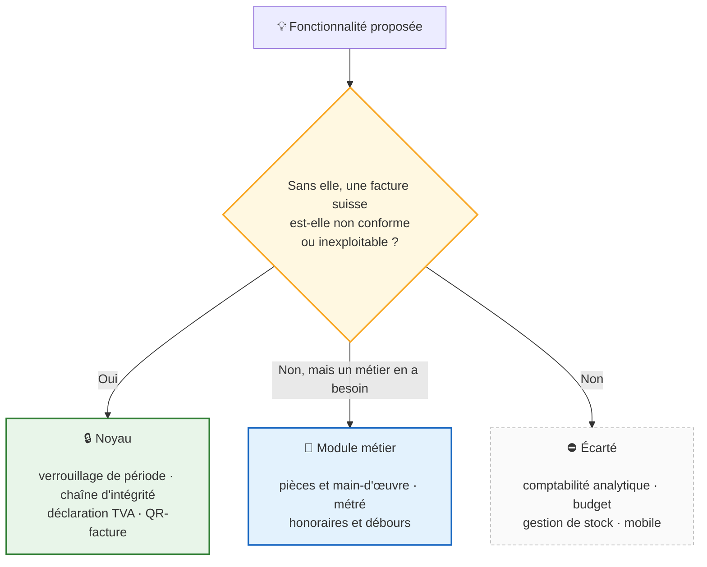

# Roadmap

**LedgerAlps est un logiciel de facturation** qui tient derrière lui la
comptabilité que la loi suisse exige d'un indépendant qui facture. Ce n'est pas
une solution comptable complète, et ce n'est pas l'objectif.

---

## Ce qui entre dans le produit, et ce qui n'y entre pas

---

## Statuts

✅ livré et validé · 🔎 livré, en attente de validation · ⏳ planifié ·
💡 à trancher · ⛔ bloqué ou écarté

---

## Conformité suisse — état

| Obligation | Base légale | État |
|---|---|---|
| Traçabilité des écritures et des documents | CO art. 957a al. 2 ch. 5 | ✅ chaîne SHA-256 vérifiable |
| Comptabilité simplifiée (« carnet du lait ») sous 500 000 francs | CO art. 957 al. 2 ch. 1 | ✅ |
| Conservation dix ans | CO art. 958f | ✅ archive légale JSON + CSV |
| Support modifiable admis | Olico art. 9 | ✅ attestation d'intégrité exportable |
| Exercice bouclé immuable | CO art. 958f, Olico art. 3 | ✅ verrouillage de période |
| Facture nommant son destinataire | LTVA art. 26 al. 2 | ✅ identité figée à l'émission |
| Interdiction de mentionner la TVA sans l'être | LTVA art. 27 al. 1 et 2 | ✅ |
| Correction par note de crédit | LTVA art. 27 al. 4, art. 41 | ✅ |
| QR-facture | SIX IG v2.4 | ✅ conforme · ⏳ validation portail SIX |
| Sécurité des données | nLPD art. 8, OPDo art. 3 | ✅ HTTPS · sauvegardes chiffrées · base chiffrable |
| Effacement et rétention | nLPD art. 6 al. 4, art. 32 | ✅ anonymisation, purge des IP |
| Portabilité | nLPD art. 25 et 28 | ✅ export par client, archive complète |

---

## Priorités

| # | Sujet | État |
|---|---|---|
| 1 | Factures fournisseurs & charges | ✅ |
| 1b | Ordre de paiement pain.001 | 🔎 validation portail SIX en attente |
| 2 | Sauvegarde & restauration | ✅ |
| 3 | Limitation des tentatives de connexion | ✅ |
| 4 | Chiffrement au repos (disque, sauvegardes, base) | ✅ |
| 4b | Durée de vie des sessions | ✅ |
| 5 | HTTPS natif | 🔎 renouvellement auto du certificat à faire |
| 6 | Rotation du secret de signature | ✅ |
| 7 | Maintenance & Système | ✅ |
| 7b | Journal et plan comptable | ✅ |
| 8 | Notes de crédit — écriture au journal | ✅ |
| 9 | Multi-utilisateurs & permissions | ✅ |
| 9b | Second facteur & réinitialisation d'accès | ✅ |
| 9c | Droits du comptable, second facteur par rôle | ✅ |
| 10 | Rapprochement bancaire (interface) | ✅ |
| 11 | eBill | ⛔ écarté — réseau fermé |
| 12 | Validation contre le portail SIX | 🔎 dossier livré, compte à créer par vous |
| 12b | Exports comptables (journal, grand livre, balance) | ✅ |
| 13 | Veille de conformité automatisée | ✅ |
| 13b | Lecture automatique d'une facture fournisseur (QR + texte) | ✅ |
| 13c | Traçabilité : couverture du journal, attestation vérifiable | ✅ |
| 13d | Retirer une facture de la liste des paiements | ✅ |
| 15 | Trouver ses marques : mise en route, statut TVA | ✅ |
| 16 | Montée react-router v6 → v7 | 💡 à planifier |
| 14 | **Modules métier** | 💡 à trancher |

---

## Détails

**1 — Factures fournisseurs & charges.** Écran Achats : saisie, comptabilisation
automatique (charge + TVA déductible au débit, créanciers au crédit), création
de fournisseur à la volée. *Reste* : notes de frais, pièces jointes.

**1b — pain.001.** L'écran Achats liste les factures comptabilisées à régler et
produit le XML e-banking ; le serveur relit créancier/IBAN/montant dans les
livres, rien n'est dicté par le navigateur. Générer ne marque rien payé — c'est
le rapprochement bancaire qui le fait. *Reste* : confirmation portail SIX.

**2 — Sauvegarde & restauration.** Instantané `VACUUM INTO`, automatique et à la
demande, chiffrable. Restauration préparée puis appliquée au redémarrage,
annulable. *Reste* : dossier externe (NAS, clé USB), test planifié.

**4 — Chiffrement au repos.** Trois protections indépendantes : chiffrement du
disque (BitLocker/LUKS, conseillé), sauvegardes (Argon2id + XChaCha20),
base de données (VFS adiantum, en Go pur). Clé scellée au compte + phrase de
récupération obligatoire ; démarrage en mode récupération si la clé devient
illisible.

**4b — Durée de vie des sessions.** Déconnexion après inactivité (10 min par
défaut, réglable 2 min–1 h ou jamais). Rotation de la clé de signature chaque
jour, au démarrage uniquement — périodicité non réglable.

**5 — HTTPS natif.** Écoute par défaut sur `127.0.0.1`. `HOST` externe impose
TLS : certificat fourni, sinon auto-signé et réutilisé. *Reste* : renouvellement
automatique, HSTS.

**6 — Rotation du secret de signature.** Bouton Maintenance → Sécurité,
administrateurs. Déconnecte toutes les sessions, ne touche à rien d'autre.

**7 — Maintenance & Système.** Cinq écrans : Diagnostic, Conformité, Piste
d'audit, Données personnelles, Sécurité & réseau. Recalcul des soldes
volontairement absent — une incohérence se corrige par une écriture, pas par un
bouton.

**7b — Journal et plan comptable.** États financiers, journal et plan comptable
fonctionnels (numéros, totaux, balance, filtre, détail scellé). *Reste* : filtre
du journal par date/compte côté interface.

**8 — Notes de crédit.** Écriture automatique à l'émission d'une facture
(débiteurs/produits/TVA) ; la note de crédit contrepasse. Éteint par défaut sur
les installations existantes. *Reste* : même mécanisme côté fournisseurs.

**9 — Multi-utilisateurs & permissions.** Trois rôles : administrateur (tout),
comptable (livres, facturation, encaissement), lecture seule (consultation,
export). Rôle relu en base à chaque requête, jamais dans le jeton. Deux barrières
indépendantes (permission par route + filtre global). Compte désactivable, non
supprimable. Détail complet : [docs/DROITS.md](docs/DROITS.md).

**9b — Second facteur & réinitialisation.** TOTP (RFC 6238) obligatoire pour les
administrateurs. Dix codes de secours à usage unique. Réinitialisation d'accès
par mot de passe temporaire, sans revoir le second facteur.

**9c — Droits du comptable.** Le comptable administre la comptabilité
(clôture, sauvegardes, fiche entreprise) ; l'administrateur administre le
logiciel et les accès. Second facteur exigé des deux. « Se souvenir de cet
ordinateur », 30 jours, date absolue.

**10 — Rapprochement bancaire.** Import camt.053 conservé, suggestions
graduées par confiance (référence certaine, montant probable, ambigu = rien
proposé). Rapprocher n'encaisse pas — geste séparé depuis la facture. *Reste* :
créer le paiement directement depuis l'écran.

**11 — eBill.** Écarté : eBill est une API OAuth exposée par un Network Partner
sous contrat, hors de portée d'un logiciel local sans appels sortants.
LedgerAlps produit déjà le PDF QR-facture que ce canal accepte en dépôt.

**12 — Validation portail SIX.** Dossier de dépôt généré par facture (payload QR
exact, PDF, marche à suivre). Le compte sur le portail reste à créer par vous.

**12b — Exports comptables.** Journal, grand livre, balance en CSV + archive
légale ZIP. Format CSV pensé pour Excel suisse (`;`, BOM UTF-8). *Reste* : format
dédié à un logiciel fiduciaire tiers, si un besoin réel se présente.

**13b — Lecture automatique des factures fournisseurs.** QR-facture décodé
(créancier, IBAN, montant, référence) et couche texte lue (numéro, date,
échéance, taux TVA, IDE) — les deux en Go pur, sans dépendance native. Rien
n'est enregistré sans confirmation. *Reste* : factures scannées sans couche
texte (demanderait l'OCR, donc une dépendance native — écarté).

**13c — Traçabilité.** Chaîne SHA-256 (CO art. 957a) sur toutes les actions
comptables déclarées, y compris les refus. Attestation vérifiable auto-émise
chaque jour ; ancrage par le déplacement des sauvegardes, aucun appel réseau.
*Reste* : journal en ajout seul hors base (écarté pour l'instant).

**13d — Vider la liste des paiements.** Annulation avec extourne plutôt que
suppression — la pièce reste dix ans (CO art. 958f). Verdict par facture :
suppression (brouillon), extourne (comptabilisée), refus (déjà réglée).

**15 — Trouver ses marques.** Liste de mise en route sur le tableau de bord
(adresse, IDE, IBAN, premier client, première facture), chaque ligne menant au
champ concerné. Statut TVA à déclarer explicitement (assujetti / non assujetti /
non déclaré). Aide contextuelle par écran. Marque du produit en haut à droite,
logotype revectorisé aux couleurs officielles (RS 232.21).

**16 — Montée react-router v6 → v7.** `npm audit` signale une redirection
ouverte (CVE-2025-68470) sur `react-router-dom` 6.30.3. Aucun chemin
d'exploitation identifié dans le routage actuel (audit 4, M-1), mais le correctif
n'existe qu'en v7 — changement majeur demandant une revalidation écran par écran,
pas un simple bump.

**14 — Modules métier.** Piste retenue, non engagée : des modules qui composent
la facture différemment selon le métier (garage, artisanat, professions
libérales), sans toucher au noyau comptable. Trois règles : absent sans que rien
ne manque, présent sans changer une règle comptable, aucun champ dédié dans le
noyau. À reprendre quand un métier précis se présente avec un besoin réel.

---

## Écarté

**Mobile / PWA** — incompatible avec l'architecture : LedgerAlps est un binaire
local, sans serveur central pour synchroniser une saisie hors-ligne.

---

## Plateformes prises en charge

| Plateforme | Livrable | État |
|---|---|---|
| Windows x86-64 | `LedgerAlps_Setup_*.exe` + `.zip` | ✅ |
| Linux x86-64 | archive `.tar.gz` | ✅ *(paquets `.deb`/`.rpm` abandonnés en v1.4.5)* |
| macOS (Intel, Apple Silicon) | — | ❌ abandonné après v1.4.1 |
| Windows / Linux ARM64 | — | ❌ abandonné après v1.4.1 |

Publiées uniquement les plateformes couvertes par la CI. macOS, Linux ARM et
Raspberry Pi restent compilables depuis les sources (`make build`, Go 1.26+).

---

## Interface multilingue

Voici les 4 langues de LedgerAlps.

| Langue | Code | Interface | Messages du serveur | Documents (PDF, CSV) | Installeur |
|---|---|---|---|---|---|
| Français | `fr` | ✅ | ✅ | ✅ | ✅ |
| Deutsch | `de` | ✅ | ✅ | ✅ | ✅ |
| Italiano | `it` | ✅ | ✅ | ✅ | ✅ |
| English | `en` | ✅ | ✅ | ✅ | ✅ |

Catalogue typé (`useT()`), pas de bibliothèque externe. Un test Go refuse toute
clé manquante, valeur vide ou restée en français. Les documents (PDF, bulletin
QR, CSV, attestation) suivent le sélecteur, pas la fiche du client.

Une vingtaine de messages de diagnostic (démarrage, outil en ligne de commande,
infrastructure) restent délibérément en français : déclarés un par un dans
`internal/i18n/diagnostic.go`.

---

## Historique

<b>Versions publiées</b> — cliquer pour dérouler

| Version | Apport principal |
|---|---|
| **v1.6.0** | **Audit 4 : trois défauts comptables critiques corrigés** — déclaration TVA qui ne ventilait jamais par taux, facture rouverte jamais recomptabilisée, adresse client contournable en modification. PostgreSQL refuse clairement plutôt que d'échouer à mi-chemin. Rotation du secret honnête sur tous les modes d'installation. Duplication du formulaire de facture éliminée |
| **v1.5.9** | Adresse client obligatoire pour la facturation QR, logo d'en-tête agrandi |
| **v1.5.8** | Extourne fournisseur correctement marquée et rattachée, port de config.json validé, `X-Forwarded-Proto` vérifié, chaîne d'approvisionnement durcie |
| **v1.5.5** | **Second audit de sécurité, plan d'action exécuté en entier.** Carnet du lait : contrepartie et seuils légaux corrigés. Base comptable Linux 0755 → 0750. Chaîne d'approvisionnement durcie. Quinze actions du journal d'audit câblées |
| **v1.5.4** | Comptabilité simplifiée (« carnet du lait ») dans Rapports, écran/CSV/PDF |
| **v1.5.3** | **Premier audit de sécurité, plan d'action exécuté.** Inscription publique retirée, `X-Forwarded-For` non fiable par défaut corrigé, installation vérifiée par empreinte SHA-256 |
| **v1.5.2** | Écran de connexion à deux panneaux, verrouillage progressif |
| **v1.5.1** | Statut TVA déclaré, marque officielle intégrée, liste de mise en route |
| **v1.5.0** | Les quatre langues officielles, de bout en bout. Lecture complète d'une facture fournisseur, QR-IBAN distingué de l'IBAN |
| **v1.4.9** | Exports comptables réels, création de fournisseur à la volée |
| **v1.4.8** | Rôles et permissions, second facteur TOTP, ordinateurs de confiance |
| **v1.4.7** | Correctifs et documentation |
| **v1.4.6** | Clôture d'exercice, verrouillage de période, piste d'audit, attestation Olico art. 9 |
| **v1.4.5** | HTTPS natif, écoute sur `127.0.0.1` par défaut, Maintenance & Système |
| **v1.4.4** | Sauvegardes chiffrées, interface de sauvegarde/restauration |
| **v1.4.3** | Flux offre → facture corrigé (LTVA art. 27 al. 2) |
| **v1.4.2** | Plateformes réduites à Windows et Linux x86-64 |
| **v1.4.1** | Assistant de démarrage réparé, jeton de rafraîchissement en cookie HttpOnly |
| **v1.4.0** | Veille de conformité : Fedlex, SIX, EUR-Lex |
| **v1.3.15** | Factures fournisseurs, impôt préalable au chiffre 400 |
| **v1.3.14** | QR-facture IG v2.4, sauvegarde/restauration CLI |
| **v1.3.13** | QR-bill SPC 0200 v2.3 |
| **v1.3.0–v1.3.12** | Logo société, conformité QR-bill itérative, ZEFIX |
| **v1.2.0** | Pipeline GoReleaser + NSIS, CLI |
| **v1.1.x** | ISO 20022, export légal, lanceur Windows, frontend embarqué |
| **v1.0.0** | Réécriture Go : moteur double-entrée, chaîne SHA-256 |

---

> **Versionnage.** `vX.Y.0` livre un milestone complet ; `vX.Y.Z` groupe les
> correctifs d'un cycle. Numéros attribués à la livraison, pas à l'avance.
